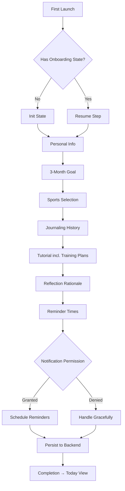
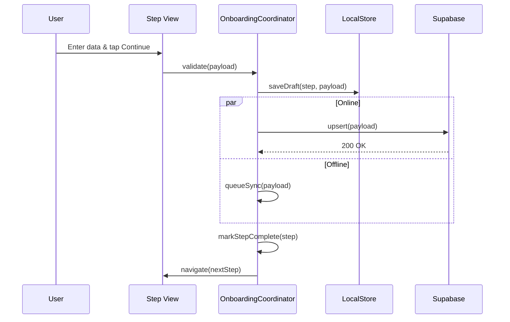
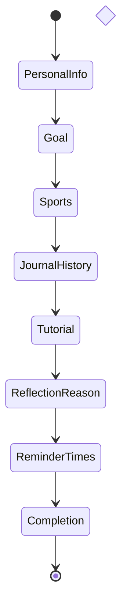
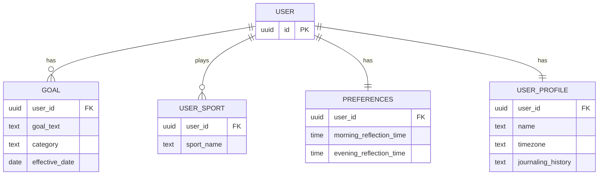
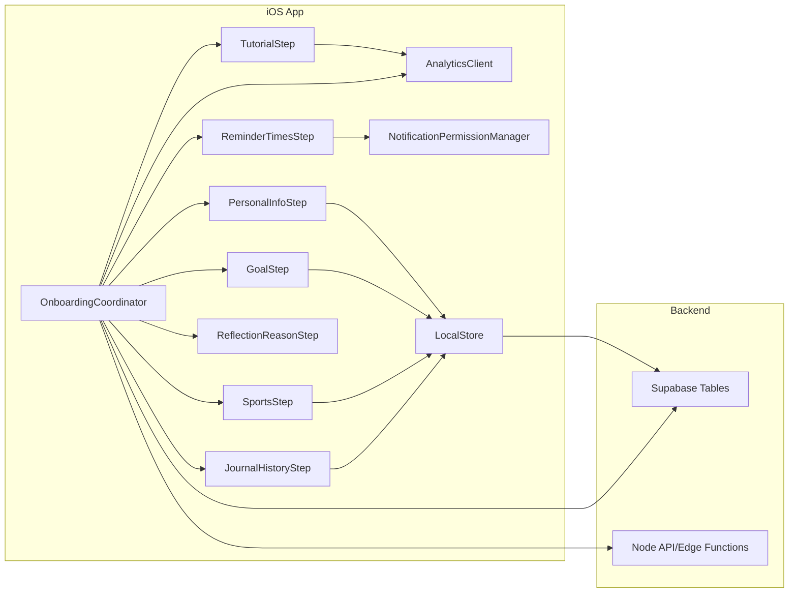

# Design

Overview

- Summary: Guided, resumable onboarding that captures personal info, 3‑month goal, sports, journaling history, teaches core concepts (reflections + Training Plans), and schedules reflection reminders.
- Goals: Fast completion, clear value communication, reliable data capture, respectful notifications.
- Non-goals: Third-party integrations setup; advanced settings; full training plan authoring.
- Key risks and mitigations: Notification opt-in (pre-permission education), drop-off (skippable/short steps), offline syncing (local queue), accessibility (adopt system traits, Dynamic Type).

Architecture

- Client (iOS SwiftUI):
  - `OnboardingCoordinator` (state machine): step progression, resume, skip handling
  - Step views: PersonalInfoStep, GoalStep, SportsStep, JournalHistoryStep, TutorialStep (with Training Plans module), ReflectionReasonStep, ReminderTimesStep, CompletionStep
  - Persistence: `LocalStore` for draft state; commit to `SupabaseManager` on step completion
  - Notifications: `NotificationPermissionManager` handles pre-prompt and scheduling
  - Analytics: `AnalyticsClient` records step events and durations
- Backend (Supabase + Node API):
  - Tables/columns: user_profile (name, timezone, journaling_history), goals (current_goal, category), sports (array or join table), preferences (morning_time, evening_time)
  - API endpoints (if needed): profile upsert, goal upsert, sports upsert, preferences update
  - Edge functions (optional): validate times, normalize timezones

Data model changes

- user_profile:
  - name (text, optional), timezone (text), journaling_history (enum: never/sometimes/regular)
- goals:
  - goal_text (text, 1–120), category (text, optional), effective_date (date)
- user_sports:
  - user_id, sport_name (text)
- preferences:
  - morning_reflection_time (time), evening_reflection_time (time)

Flows

- Sequence (high-level):
  1. First launch → OnboardingCoordinator initializes from `LocalStore` snapshot
  2. Personal info → save local + remote
  3. 3‑month goal → save local + remote
  4. Sports selection → save local + remote
  5. Journaling history → save local + remote
  6. Tutorial (incl. Training Plans) → mark viewed/skip; deep link targets: Training Plans tab, Today view
  7. Reflection rationale → continue
  8. Reminder times → pre-permission edu → OS prompt → schedule local notifications → save to backend
  9. Completion → navigate to Today view

- State transitions:
  - Each step commits `OnboardingState` with fields for completion flags and payload values; persisted after each step
  - Resume logic chooses next incomplete step; back navigation allowed within onboarding scope

Implementation considerations

- Error handling: show inline validation; for network errors, store locally and retry with backoff
- Telemetry/metrics: time-in-step, skip reasons, opt-in conversion, first reflection completion within 48h
- Performance: lazy load tutorial assets; prefetch next step
- Security & privacy: minimal PII; encrypt local store if sensitive; avoid logging free-text goal content

Alternatives considered

- Single long form vs multi-step wizard (chosen: multi-step for clarity and drop-off control)
- Server-driven onboarding content (deferred; consider remote-config later)

Dependencies

- iOS notification permission APIs
- Supabase tables/columns present; mobile SDK configured

Open questions

- Default reminder times by locale? (e.g., 7:00 AM, 8:30 PM)
- Age handling needed? (if age is requested vs age range)

References

- Kiro Concepts: https://kiro.dev/docs/specs/concepts/

Diagrams

Flowchart (user flow)

Sequence (saving a step)

State machine (coordinator)

ER (simplified data model)

Component overview

