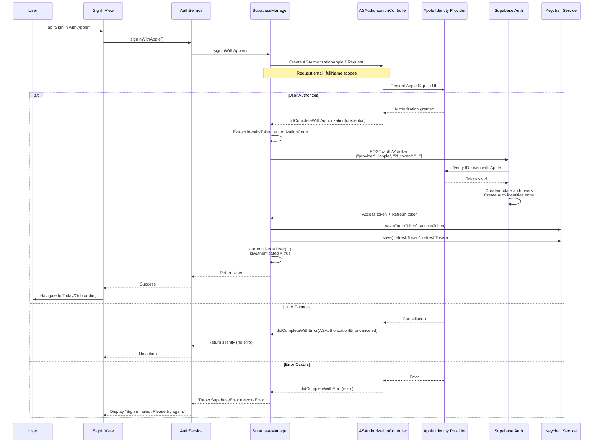
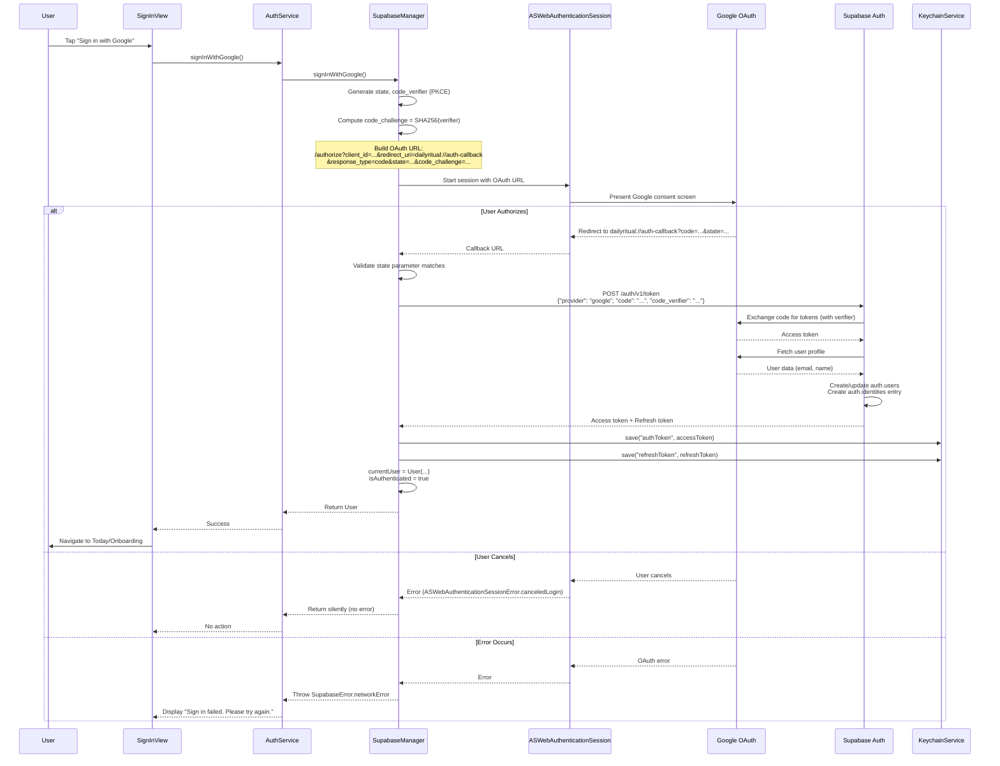
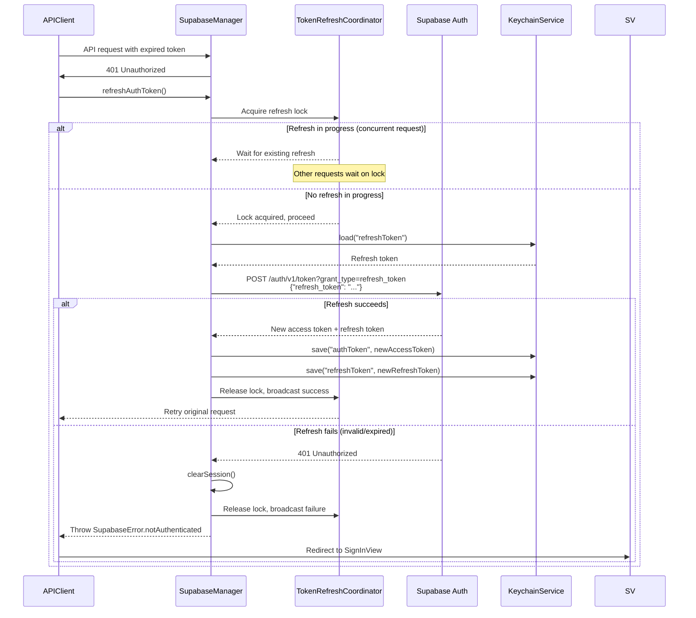
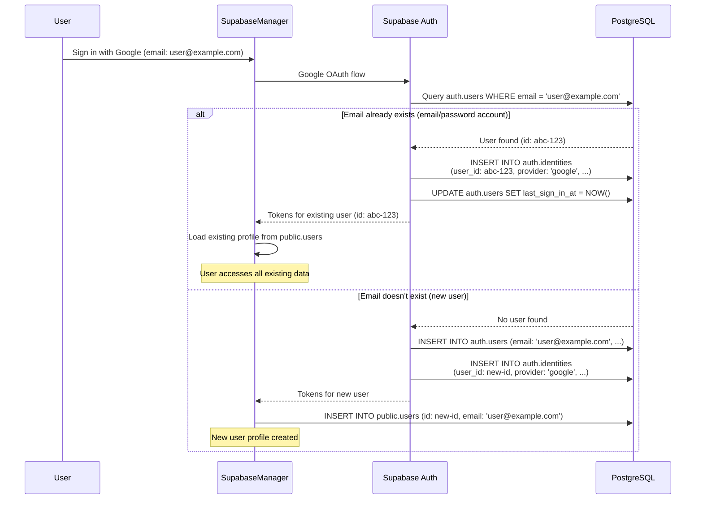
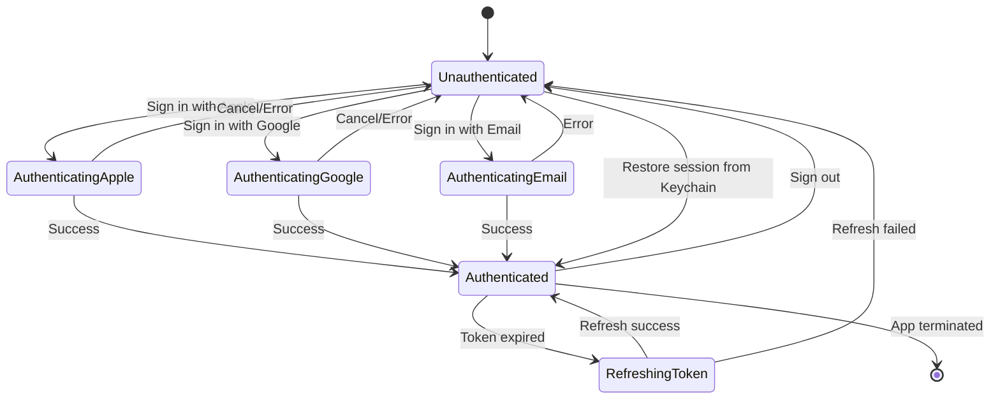

# Design

## Overview

### Summary
Implement native Apple Sign In and Google Sign In authentication by enhancing the existing OAuth infrastructure in SupabaseManager. The design leverages iOS's ASAuthorizationController for Apple authentication and ASWebAuthenticationSession for Google OAuth, with unified token management via Keychain and automatic account linking via Supabase Auth.

### Goals
- **Reduce authentication friction:** One-tap sign-in with platform credentials
- **Improve conversion:** Native authentication drives 2-3x higher completion rates than email/password
- **Enhance security:** Leverage platform-managed credentials and secure token storage
- **Maintain flexibility:** Keep email/password as fallback for users who prefer it

### Non-Goals
- Building custom OAuth infrastructure (use Supabase Auth)
- Supporting additional social providers beyond Apple/Google in this phase
- Implementing device-specific biometric unlock (Face ID/Touch ID for app access)
- Building account migration tools for cross-platform auth

### Key Risks and Mitigations

| Risk | Impact | Mitigation |
|------|--------|------------|
| Apple OAuth configuration issues | High - blocks iOS users | Pre-validate Apple Developer setup, test with TestFlight before production |
| Google OAuth consent screen rejection | Medium - delays launch | Follow Google's verification guidelines, prepare assets in advance |
| Token refresh race conditions | High - session corruption | Implement token refresh mutex, single-flight pattern for concurrent requests |
| Account linking conflicts | Medium - data loss | Add confirmation UI for ambiguous cases, audit log all linking operations |
| Callback URL scheme hijacking | High - security breach | Validate state parameter, implement callback URL validation |
| iOS version fragmentation | Low - limited reach | Graceful degradation for iOS <13, show email/password only |

## Architecture

### Component Overview

```
┌─────────────────────────────────────────────────────────────────┐
│                          iOS App Layer                           │
├─────────────────────────────────────────────────────────────────┤
│                                                                  │
│  ┌──────────────────┐     ┌──────────────────────────────────┐ │
│  │   SignInView     │────▶│      AuthViewModel              │ │
│  │  (SwiftUI)       │     │  - authState: AuthState         │ │
│  └──────────────────┘     │  - errorMessage: String?        │ │
│                            │  - isLoading: Bool              │ │
│                            └────────────┬─────────────────────┘ │
│                                         │                        │
│                                         ▼                        │
│                            ┌──────────────────────────────────┐ │
│                            │      AuthService                 │ │
│                            │  + signInWithApple()             │ │
│                            │  + signInWithGoogle()            │ │
│                            │  + signIn(email, password)       │ │
│                            │  + signOut()                     │ │
│                            │  + refreshAuthToken()            │ │
│                            └────────────┬─────────────────────┘ │
│                                         │                        │
│                                         ▼                        │
│  ┌─────────────────────────────────────────────────────────────┐ │
│  │                    SupabaseManager                          │ │
│  │  ┌────────────────────┐  ┌──────────────────────────────┐ │ │
│  │  │ Apple Sign In      │  │ Google Sign In               │ │ │
│  │  │ - ASAuthorization  │  │ - ASWebAuthSession           │ │ │
│  │  │   Controller       │  │ - OAuth 2.0 PKCE             │ │ │
│  │  └────────────────────┘  └──────────────────────────────┘ │ │
│  │                                                             │ │
│  │  ┌─────────────────────────────────────────────────────┐  │ │
│  │  │           Token Management                          │  │ │
│  │  │  - authToken (access)                               │  │ │
│  │  │  - refreshToken                                     │  │ │
│  │  │  - TokenRefreshCoordinator (mutex)                 │  │ │
│  │  └─────────────────────────────────────────────────────┘  │ │
│  │                                                             │ │
│  │  ┌─────────────────────────────────────────────────────┐  │ │
│  │  │           KeychainService                           │  │ │
│  │  │  - save(service, account, data)                     │  │ │
│  │  │  - load(service, account) -> Data?                  │  │ │
│  │  │  - delete(service, account)                         │  │ │
│  │  └─────────────────────────────────────────────────────┘  │ │
│  └─────────────────────────────────────────────────────────────┘ │
│                                         │                        │
└─────────────────────────────────────────┼────────────────────────┘
                                          │ HTTPS
                                          ▼
┌─────────────────────────────────────────────────────────────────┐
│                        Backend Layer                             │
├─────────────────────────────────────────────────────────────────┤
│                                                                  │
│  ┌──────────────────────────────────────────────────────────┐  │
│  │              Supabase Auth Service                       │  │
│  │  ┌──────────────┐  ┌──────────────┐  ┌──────────────┐  │  │
│  │  │ Apple OAuth  │  │ Google OAuth │  │ Email/Pass   │  │  │
│  │  │ Provider     │  │ Provider     │  │ Provider     │  │  │
│  │  └──────────────┘  └──────────────┘  └──────────────┘  │  │
│  │                                                          │  │
│  │  - Token validation                                     │  │
│  │  - Token refresh endpoint                               │  │
│  │  - Account linking logic                                │  │
│  └──────────────────────────────────────────────────────────┘  │
│                                                                  │
│  ┌──────────────────────────────────────────────────────────┐  │
│  │              Node.js API (Express)                       │  │
│  │  /api/v1/auth/callback - OAuth redirect handler         │  │
│  │  /api/v1/profile - User profile fetch/update            │  │
│  │  Middleware: authenticateToken (JWT validation)         │  │
│  └──────────────────────────────────────────────────────────┘  │
│                                                                  │
│  ┌──────────────────────────────────────────────────────────┐  │
│  │              PostgreSQL (Supabase)                       │  │
│  │  auth.users - Supabase managed auth table               │  │
│  │  public.users - App user profiles                       │  │
│  │  auth.identities - OAuth provider links                 │  │
│  └──────────────────────────────────────────────────────────┘  │
│                                                                  │
└─────────────────────────────────────────────────────────────────┘
```

### Component Responsibilities

#### **SignInView** (SwiftUI)
- Render authentication UI with branded buttons
- Handle user interactions (button taps)
- Display loading states and error messages
- Follow Apple/Google branding guidelines

#### **AuthViewModel** (ObservableObject)
- Manage authentication UI state
- Coordinate auth method selection
- Handle navigation after successful auth
- Present user-friendly error messages

#### **AuthService** (Protocol + Implementation)
- Facade for authentication operations
- Provide method-agnostic auth interface
- Coordinate between UI and SupabaseManager
- Abstract authentication details from view layer

#### **SupabaseManager**
- **Apple Sign In Module:**
  - Create ASAuthorizationAppleIDRequest
  - Handle ASAuthorizationControllerDelegate callbacks
  - Extract credentials and user info
  - Exchange Apple ID token with Supabase
  
- **Google Sign In Module:**
  - Construct OAuth authorization URL with PKCE
  - Launch ASWebAuthenticationSession
  - Parse callback URL for tokens
  - Validate state parameter
  - Exchange code for tokens with Supabase

- **Token Management:**
  - Store/retrieve tokens via KeychainService
  - Implement token refresh with mutex
  - Handle token expiration gracefully
  - Coordinate refresh across concurrent requests

#### **KeychainService** (Utility)
- Persist sensitive data (tokens) securely
- Use appropriate security attributes
- Handle Keychain errors gracefully
- Support atomic read-modify-write operations

#### **Supabase Auth Service** (Backend)
- Validate OAuth tokens with Apple/Google
- Issue JWT access/refresh tokens
- Handle account creation/linking
- Enforce security policies (rate limiting, etc.)

#### **Node.js API** (Backend)
- Validate Supabase JWTs
- Fetch/create user profiles
- Handle OAuth callback redirects (if needed)
- Provide profile management endpoints

## Data Model

### Existing Schema

```sql
-- Managed by Supabase Auth
auth.users (
  id uuid PRIMARY KEY,
  email text,
  encrypted_password text,
  email_confirmed_at timestamptz,
  last_sign_in_at timestamptz,
  created_at timestamptz,
  updated_at timestamptz,
  -- OAuth-specific fields populated by Supabase
  raw_app_meta_data jsonb,
  raw_user_meta_data jsonb
)

auth.identities (
  id text PRIMARY KEY,
  user_id uuid REFERENCES auth.users(id),
  identity_data jsonb,
  provider text, -- 'apple', 'google', 'email'
  last_sign_in_at timestamptz,
  created_at timestamptz,
  updated_at timestamptz
)

-- App-managed profile table
public.users (
  id uuid PRIMARY KEY REFERENCES auth.users(id),
  email text,
  name text,
  avatar_url text,
  timezone text,
  is_premium boolean,
  created_at timestamptz,
  updated_at timestamptz
)
```

### Data Model Changes

**No schema changes required.** Existing Supabase tables support OAuth out of the box:
- `auth.users` stores the unified user account
- `auth.identities` tracks linked OAuth providers
- `public.users` stores app-specific profile data

### OAuth Identity Linking

Supabase automatically handles account linking based on email:
- **Same email → Automatic linking:** If user signs in with Google and later with Apple using the same email, Supabase links them to the same `auth.users` record
- **Hide My Email → Separate account:** Apple relay emails create separate accounts (expected behavior)
- **Multiple identities:** A single user can have multiple entries in `auth.identities` (apple, google, email)

### Profile Data Mapping

| OAuth Field | Source | Destination | Notes |
|-------------|--------|-------------|-------|
| Email | Apple/Google profile | `auth.users.email`, `public.users.email` | Primary identifier (unless Hide My Email) |
| Name | Apple/Google profile | `public.users.name` | Optional, pre-filled for onboarding |
| Avatar | Google profile | `public.users.avatar_url` | Apple doesn't provide avatar |
| Provider | OAuth type | `auth.identities.provider` | 'apple' or 'google' |
| Provider User ID | OAuth sub/id | `auth.identities.id` | Unique per provider |

## Flows

### 1. Apple Sign In Flow



### 2. Google Sign In Flow



### 3. Token Refresh Flow (Existing, Enhanced)



### 4. Account Linking Flow



### State Machine: Authentication State



## Implementation Considerations

### Error Handling Strategy

| Error Type | User Message | Recovery Action | Logging |
|------------|--------------|-----------------|---------|
| User cancellation | None (silent) | Return to sign-in screen | Info level |
| Network error | "Connection failed. Please check your internet and try again." | Retry button | Warning level |
| Invalid OAuth callback | "Sign in failed. Please try again." | Return to sign-in screen | Error level |
| Token refresh failure | "Session expired. Please sign in again." | Clear session, redirect to sign-in | Warning level |
| Server error (5xx) | "Service temporarily unavailable. Please try again later." | Retry button | Error level |
| Account linking conflict | "This email is already associated with another account." | Show account linking UI | Info level |

### Security Considerations

#### **Token Storage**
- Use Keychain with `kSecAttrAccessibleWhenUnlocked` (tokens accessible only when device unlocked)
- Never store tokens in UserDefaults, file system, or app group containers
- Use separate Keychain entries for access token and refresh token

#### **OAuth State Parameter**
- Generate cryptographically secure random state (32+ bytes)
- Store state in memory before OAuth flow
- Validate state in callback URL matches stored value (prevents CSRF)
- Reject callback if state validation fails

#### **HTTPS Enforcement**
- All network communication over TLS 1.2+
- Pin Supabase certificate (optional, for high-security requirements)
- Reject self-signed certificates in production

#### **Token Transmission**
- Send tokens in `Authorization: Bearer <token>` header only
- Never include tokens in URL query parameters (prevents log leakage)
- Set short access token lifetime (1 hour) with refresh token rotation

### Performance Considerations

#### **Cold Start Optimization**
- Load Keychain tokens synchronously on app launch (fast operation, <100ms)
- Restore auth state before presenting UI (avoid flash of sign-in screen)
- Prefetch user profile in background after auth restoration

#### **Token Refresh Optimization**
- Implement single-flight token refresh (deduplicate concurrent refresh requests)
- Use mutex/lock to prevent refresh race conditions
- Cache refreshed token for 5 seconds to serve concurrent requests

#### **UI Responsiveness**
- Show loading indicator immediately on button tap
- Disable auth buttons during authentication (prevent double-submission)
- Use Task with priority `.userInitiated` for auth operations
- Timeout OAuth flows after 60 seconds

### Accessibility

- **VoiceOver Labels:**
  - "Sign in with Apple" button: "Sign in with Apple. Double tap to authenticate using your Apple ID."
  - "Sign in with Google" button: "Sign in with Google. Double tap to authenticate using your Google account."
  - Error messages: Announced immediately when displayed

- **Dynamic Type:** Support text scaling for button labels and error messages

- **Touch Targets:** Maintain 44x44 point minimum for all interactive elements

- **Focus Management:** Move VoiceOver focus to error messages when displayed

### Telemetry & Metrics

Track the following events:

| Event | Properties | Purpose |
|-------|-----------|---------|
| `auth_method_selected` | `method: apple\|google\|email` | Measure adoption of each auth method |
| `auth_started` | `method: apple\|google\|email` | Track funnel start |
| `auth_completed` | `method: apple\|google\|email`, `duration_ms: number` | Measure success rate and performance |
| `auth_failed` | `method: apple\|google\|email`, `error_type: string` | Track error types for debugging |
| `auth_cancelled` | `method: apple\|google\|email` | Understand user drop-off |
| `token_refresh_attempted` | `reason: expired\|unauthorized` | Monitor refresh frequency |
| `token_refresh_failed` | `error_type: string` | Alert on refresh issues |
| `account_linked` | `existing_provider: email`, `new_provider: apple\|google` | Track linking success |

### Testing Strategy

#### **Unit Tests**
- Token refresh logic with concurrent requests
- OAuth state parameter generation and validation
- Keychain save/load operations
- Error message formatting

#### **Integration Tests**
- Full Apple Sign In flow (TestFlight)
- Full Google Sign In flow
- Account linking with existing email/password account
- Token expiration and refresh
- Sign-out and session cleanup

#### **Manual QA Checklist**
- [ ] Apple Sign In with new Apple ID
- [ ] Apple Sign In with existing Apple ID
- [ ] Apple "Hide My Email" feature
- [ ] Google Sign In with new Google account
- [ ] Google Sign In with existing Google account
- [ ] Account linking (Google → existing email account)
- [ ] Account linking (Apple → existing email account)
- [ ] Sign out and sign back in
- [ ] Token refresh during active session
- [ ] App restart with valid session
- [ ] Network error during authentication
- [ ] User cancellation of OAuth flow
- [ ] Expired session handling
- [ ] Multiple concurrent API requests with expired token

## Alternatives Considered

### Alternative 1: Native Google Sign-In SDK

**Approach:** Use Google's official iOS SDK (`GoogleSignIn`) instead of web-based OAuth via ASWebAuthenticationSession.

**Pros:**
- Smoother UX with native iOS SDK
- Better error handling and diagnostics
- Automatic token refresh handled by SDK

**Cons:**
- Additional dependency (increases app size by ~2MB)
- Extra maintenance burden (SDK updates)
- Less consistent with Apple Sign In flow
- Requires separate Google Services configuration file

**Decision:** **Use ASWebAuthenticationSession** for consistency with Apple approach and to minimize dependencies. Performance difference is negligible for authentication (one-time operation).

### Alternative 2: Firebase Authentication

**Approach:** Use Firebase Auth instead of Supabase Auth for OAuth handling.

**Pros:**
- Mature SDK with extensive documentation
- Built-in account linking UI
- More granular error codes

**Cons:**
- Requires migration from Supabase Auth (breaking change)
- Additional service dependency
- Increased complexity (Supabase + Firebase)
- Monthly cost for Firebase usage

**Decision:** **Use Supabase Auth** to leverage existing infrastructure and avoid vendor proliferation.

### Alternative 3: Backend-Initiated OAuth

**Approach:** Have backend handle OAuth redirect and return tokens to app via custom URL scheme.

**Pros:**
- Backend has full control over OAuth flow
- Easier to implement rate limiting
- Can log OAuth events server-side

**Cons:**
- More complex flow (app → backend → OAuth → backend → app)
- Higher latency (extra network roundtrip)
- Requires backend route for OAuth initiation
- Less secure (backend receives OAuth code)

**Decision:** **Use client-initiated OAuth** for better performance and security. Mobile apps should handle OAuth directly per OAuth 2.0 for Native Apps (RFC 8252).

### Alternative 4: Email Magic Links

**Approach:** Offer passwordless email authentication (click link in email to sign in) as alternative to OAuth.

**Pros:**
- No password management
- Simple UX for users without Apple/Google accounts
- Built into Supabase Auth

**Cons:**
- Requires email client access
- Higher friction than OAuth (wait for email)
- Not suitable for onboarding (slow)
- Email deliverability issues

**Decision:** **Out of scope for this phase.** Keep email/password as fallback. Consider magic links in future phase after OAuth adoption metrics are analyzed.

## Dependencies

### iOS
- iOS 13.0+ (for ASAuthorizationController)
- iOS 12.0+ (for ASWebAuthenticationSession)
- AuthenticationServices framework
- Security framework (Keychain)

### Backend
- Supabase project with Auth enabled
- Apple OAuth provider configured in Supabase dashboard:
  - Services ID registered in Apple Developer portal
  - Private key uploaded to Supabase
  - Redirect URI: `https://<project-ref>.supabase.co/auth/v1/callback`
  
- Google OAuth provider configured in Supabase dashboard:
  - OAuth 2.0 Client ID created in Google Cloud Console
  - Authorized redirect URI: `https://<project-ref>.supabase.co/auth/v1/callback`
  - OAuth consent screen configured

### Apple Developer Portal
- Sign in with Apple capability enabled for App ID
- Services ID created (e.g., `com.dailyritual.services`)
- Return URLs configured: `https://<project-ref>.supabase.co/auth/v1/callback`

### Google Cloud Console
- OAuth 2.0 Client ID (iOS)
- iOS URL scheme registered: `dailyritual`
- OAuth consent screen approved (at least testing mode)

### Xcode Configuration
- URL scheme registered: `dailyritual`
- Associated domain (if using universal links): `applinks:dailyritual.app`
- Keychain sharing entitlement (if multi-app support needed)

## Open Questions

1. **Should we prompt users to link accounts when email matches?**
   - Current design: Automatic linking
   - Alternative: Show confirmation dialog before linking
   - **Recommendation:** Start with automatic linking (lower friction), add confirmation if users report unexpected behavior

2. **How to handle users who switch devices?**
   - Session persists via Keychain (device-local)
   - Users must re-authenticate on new device
   - **Recommendation:** Accept current behavior, consider "remember me" server-side sessions in future

3. **Should we support anonymous authentication for trial?**
   - Allows users to explore app without sign-in
   - Requires account conversion flow later
   - **Recommendation:** Out of scope. Core value requires persistent data, so authentication is essential

4. **Rate limiting for authentication attempts?**
   - Backend currently has no auth rate limiting
   - Risk: Credential stuffing attacks
   - **Recommendation:** Implement backend rate limiting (10 attempts per IP per hour) in parallel with this work

## References

- Kiro Concepts: https://kiro.dev/docs/specs/concepts/
- Apple Sign In: https://developer.apple.com/documentation/authenticationservices/implementing_user_authentication_with_sign_in_with_apple
- Google Sign In for iOS: https://developers.google.com/identity/sign-in/ios/start-integrating
- Supabase OAuth Providers: https://supabase.com/docs/guides/auth/social-login
- OAuth 2.0 for Native Apps (RFC 8252): https://datatracker.ietf.org/doc/html/rfc8252
- PKCE (RFC 7636): https://datatracker.ietf.org/doc/html/rfc7636
- iOS Keychain Services: https://developer.apple.com/documentation/security/keychain_services
- Apple Human Interface Guidelines - Sign in with Apple: https://developer.apple.com/design/human-interface-guidelines/sign-in-with-apple


