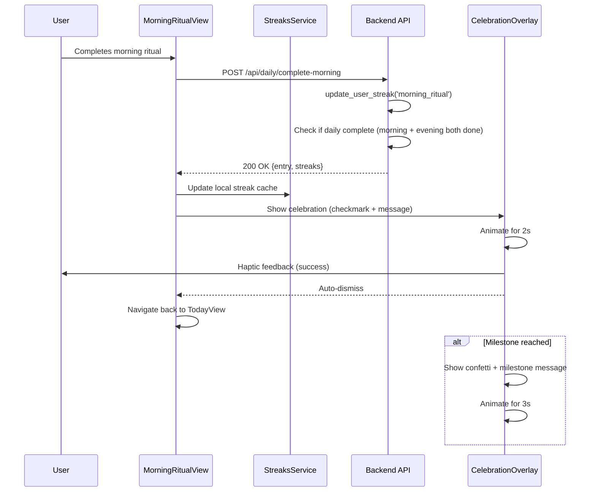
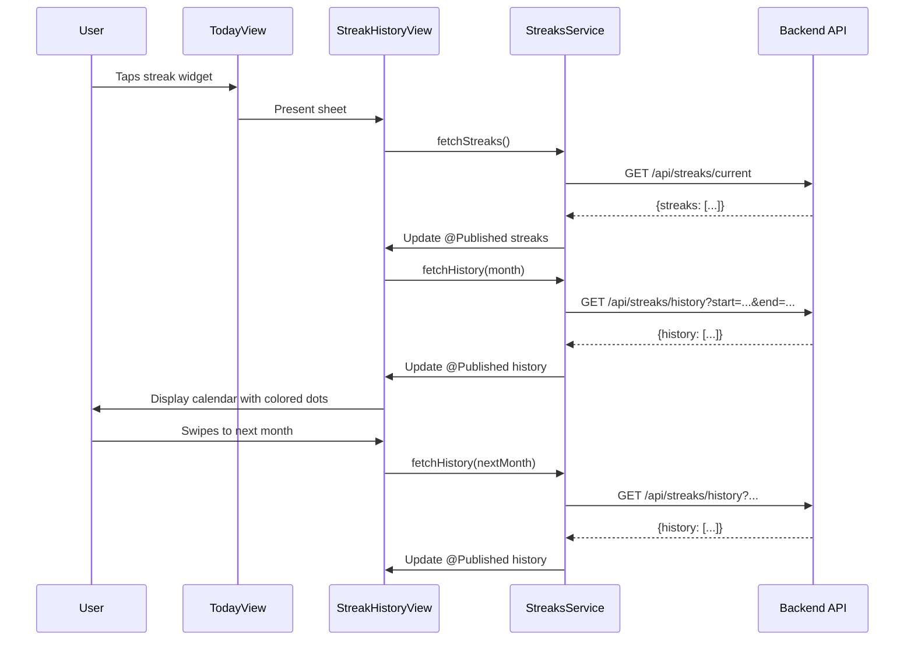
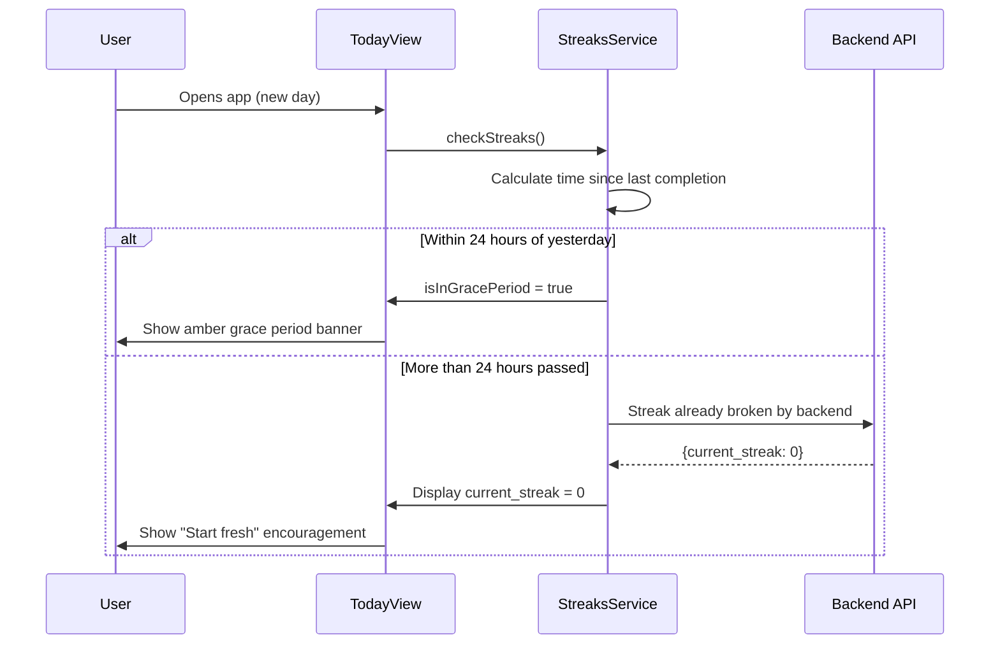

# Design

## Overview

### Summary
This feature adds habit tracking with visible streaks and celebratory animations to reinforce daily journaling practice for athletes. Building on the existing `user_streaks` database table and `update_user_streak` function, we'll create a comprehensive UI system that displays streak progress, celebrates completions, and uses gentle reminders to maintain momentum.

### Goals
- **Primary Goal:** Increase daily completion rate by 20%+ through visible progress tracking and positive reinforcement
- **Secondary Goal:** Improve 7-day retention by 30%+ via habit formation mechanics
- **UX Goal:** Provide tasteful celebrations appropriate for competitive athletes (ages 20-40)
- **Technical Goal:** Leverage existing backend infrastructure with minimal schema changes

### Non-Goals
- Social features (leaderboards, sharing, friend competition)
- Advanced gamification (badges, points, levels, achievements beyond streaks)
- Workout reflection streaks (Phase 2 post-integration)
- Streak repair/freeze mechanisms (future premium feature)
- Custom notification scheduling (use fixed 2-hour-before-midnight logic)

### Key Risks and Mitigations

| Risk | Impact | Probability | Mitigation |
|------|--------|-------------|------------|
| Celebrations feel childish/patronizing | High | Medium | Design tasteful, quick animations; test with target demographic; make skippable |
| Streak anxiety causes user burnout | High | Medium | Implement 24-hour grace period; emphasize "longest streak" over current; gentle reminder copy |
| Performance degradation from animations | Medium | Low | Use lightweight animation library; optimize rendering; cap frame rate requirements at 60fps on iPhone 11+ |
| Backend streak logic has bugs | High | Low | Comprehensive testing of existing function; add monitoring; implement client-side validation |
| Timezone edge cases break streaks | Medium | Medium | Store user timezone; calculate in user's local time; extensive timezone testing |

## Architecture

### System Components

```
┌─────────────────────────────────────────────────────────────┐
│                      iOS App (SwiftUI)                      │
├─────────────────────────────────────────────────────────────┤
│                                                             │
│  ┌──────────────────┐  ┌──────────────────┐               │
│  │  TodayView       │  │ StreakHistoryView│               │
│  │  (Streak Widget) │  │ (Calendar View)  │               │
│  └────────┬─────────┘  └────────┬─────────┘               │
│           │                     │                          │
│           └─────────┬───────────┘                          │
│                     │                                      │
│           ┌─────────▼──────────┐                          │
│           │  CelebrationView   │                          │
│           │  (Animation Layer) │                          │
│           └─────────┬──────────┘                          │
│                     │                                      │
│           ┌─────────▼──────────┐                          │
│           │ StreaksService.swift│                         │
│           │ - fetchStreaks()    │                         │
│           │ - getHistory()      │                         │
│           │ - checkGracePeriod()│                         │
│           └─────────┬──────────┘                          │
└─────────────────────┼──────────────────────────────────────┘
                      │
                      │ HTTPS (Supabase SDK)
                      │
┌─────────────────────▼──────────────────────────────────────┐
│              Backend (Express.js + Supabase)               │
├─────────────────────────────────────────────────────────────┤
│                                                             │
│  ┌──────────────────────────────────────────────────────┐  │
│  │  /api/streaks/current                                │  │
│  │  GET - Returns current streak stats                  │  │
│  └──────────────────────────────────────────────────────┘  │
│                                                             │
│  ┌──────────────────────────────────────────────────────┐  │
│  │  /api/streaks/history?start=YYYY-MM-DD&end=...      │  │
│  │  GET - Returns completion history for calendar       │  │
│  └──────────────────────────────────────────────────────┘  │
│                                                             │
│  ┌──────────────────────────────────────────────────────┐  │
│  │  Existing: /api/daily/complete-morning               │  │
│  │  Already calls update_user_streak() function         │  │
│  └──────────────────────────────────────────────────────┘  │
│                                                             │
└─────────────────────┬───────────────────────────────────────┘
                      │
                      │ SQL
                      │
┌─────────────────────▼──────────────────────────────────────┐
│                 Supabase PostgreSQL                        │
├─────────────────────────────────────────────────────────────┤
│                                                             │
│  user_streaks table (existing)                             │
│  - id, user_id, streak_type                                │
│  - current_streak, longest_streak                          │
│  - last_completed_date, updated_at                         │
│                                                             │
│  update_user_streak(user_id, type, date) function         │
│  - Validates consecutive days                              │
│  - Updates current_streak or resets to 1                   │
│  - Updates longest_streak if exceeded                      │
│                                                             │
│  daily_entries table (for history)                         │
│  - morning_completed_at, evening_completed_at              │
│                                                             │
└─────────────────────────────────────────────────────────────┘
```

### Component Responsibilities

#### **Frontend Components**

**StreakWidgetView** (New)
- Display current streaks inline on Today view
- Show flame icon with streak count
- Indicate grace period status if active
- Tappable to navigate to detailed history
- Adapts to morning/evening time context colors

**CelebrationOverlay** (New)
- Full-screen overlay for celebration animations
- Triggered on completion of morning/evening/daily
- Different animation styles for milestones (3, 7, 14, 30, 60, 100, 365 days)
- Auto-dismisses after 2-3 seconds or user tap
- Haptic feedback integrated

**StreakHistoryView** (New)
- Calendar visualization of completion history
- Color-coded: morning only (gold), evening only (blue), both (green)
- Statistics summary: current streaks, longest streaks, completion rate
- Scrollable monthly view with year navigation

**StreaksService** (New)
- Fetches streak data from backend
- Caches locally for offline support
- Calculates grace period status client-side
- Exposes `@Published` properties for SwiftUI reactivity

#### **Backend Components**

**StreaksController** (New)
- `/api/streaks/current` - Get current streak stats for user
- `/api/streaks/history` - Get completion history for date range
- Uses existing `DatabaseService` to query `user_streaks` table
- No changes to existing streak update logic (already working in dailyEntries.ts)

**DatabaseService** (Extend existing)
- Add query methods: `getUserStreaks()`, `getCompletionHistory()`
- Existing `updateUserStreak()` continues to work unchanged

## Data Model

### Existing Schema (No Changes Required)

```sql
-- user_streaks table (already exists)
CREATE TABLE user_streaks (
    id UUID PRIMARY KEY DEFAULT uuid_generate_v4(),
    user_id UUID REFERENCES users(id) ON DELETE CASCADE,
    streak_type TEXT CHECK (streak_type IN ('morning_ritual', 'workout_reflection', 'evening_reflection', 'daily_complete')),
    current_streak INTEGER DEFAULT 0,
    longest_streak INTEGER DEFAULT 0,
    last_completed_date DATE,
    updated_at TIMESTAMP WITH TIME ZONE DEFAULT NOW(),
    UNIQUE(user_id, streak_type)
);

-- update_user_streak function (already exists)
CREATE OR REPLACE FUNCTION update_user_streak(
    p_user_id UUID,
    p_streak_type TEXT,
    p_completed_date DATE DEFAULT CURRENT_DATE
) RETURNS VOID AS $$
-- Function logic validates consecutive days, updates current/longest streaks
$$ LANGUAGE plpgsql;
```

### New Swift Models

```swift
// Streak data model
struct UserStreak: Codable, Identifiable, Sendable {
    let id: UUID
    let userId: UUID
    let streakType: StreakType
    var currentStreak: Int
    var longestStreak: Int
    var lastCompletedDate: Date?
    let updatedAt: Date
    
    enum StreakType: String, Codable, CaseIterable {
        case morningRitual = "morning_ritual"
        case eveningReflection = "evening_reflection"
        case dailyComplete = "daily_complete"
        
        var displayName: String {
            switch self {
            case .morningRitual: return "Morning Ritual"
            case .eveningReflection: return "Evening Reflection"
            case .dailyComplete: return "Perfect Days"
            }
        }
        
        var icon: String {
            switch self {
            case .morningRitual: return "sunrise.fill"
            case .eveningReflection: return "moon.stars.fill"
            case .dailyComplete: return "checkmark.circle.fill"
            }
        }
    }
    
    // Grace period check (24 hours from last completion)
    var isInGracePeriod: Bool {
        guard let lastDate = lastCompletedDate else { return false }
        let calendar = Calendar.current
        let now = Date()
        let daysSinceCompletion = calendar.dateComponents([.day], from: lastDate, to: now).day ?? 0
        return daysSinceCompletion == 1 && calendar.component(.hour, from: now) < 24
    }
    
    var gracePeriodHoursRemaining: Int? {
        guard isInGracePeriod, let lastDate = lastCompletedDate else { return nil }
        let calendar = Calendar.current
        let now = Date()
        let tomorrow = calendar.date(byAdding: .day, value: 1, to: lastDate)!
        let components = calendar.dateComponents([.hour], from: now, to: tomorrow)
        return max(0, components.hour ?? 0)
    }
}

// Completion history item for calendar view
struct CompletionHistoryItem: Identifiable, Sendable {
    let id: UUID
    let date: Date
    let morningCompleted: Bool
    let eveningCompleted: Bool
    
    var completionStatus: CompletionStatus {
        if morningCompleted && eveningCompleted { return .both }
        if morningCompleted { return .morningOnly }
        if eveningCompleted { return .eveningOnly }
        return .none
    }
    
    enum CompletionStatus {
        case none, morningOnly, eveningOnly, both
        
        var color: Color {
            switch self {
            case .none: return DesignSystem.Colors.divider
            case .morningOnly: return DesignSystem.Colors.eliteGold.opacity(0.6)
            case .eveningOnly: return DesignSystem.Colors.championBlue.opacity(0.6)
            case .both: return DesignSystem.Colors.powerGreen
            }
        }
    }
}

// Celebration milestone enum
enum CelebrationMilestone: Int, CaseIterable {
    case day3 = 3
    case day7 = 7
    case day14 = 14
    case day30 = 30
    case day60 = 60
    case day100 = 100
    case day365 = 365
    
    var message: String {
        switch self {
        case .day3: return "3 days strong! Building momentum 🔥"
        case .day7: return "7 day streak! You're building a habit 💪"
        case .day14: return "2 weeks in! Consistency pays off 🌟"
        case .day30: return "30 days! This is who you are now 🏆"
        case .day60: return "60 days of dedication! Unstoppable 🚀"
        case .day100: return "100 day milestone! Elite commitment 👑"
        case .day365: return "365 days! You're a legend 🎉"
        }
    }
    
    var animationIntensity: CelebrationIntensity {
        switch self {
        case .day3, .day7: return .standard
        case .day14, .day30: return .enhanced
        case .day60, .day100, .day365: return .epic
        }
    }
}

enum CelebrationIntensity {
    case standard  // Basic animation + haptic
    case enhanced  // Confetti + sound + haptic
    case epic      // Full celebration with longer animation
}
```

## UI/UX Design

### Streak Widget on Today View

**Location:** Top of Today view, above morning/evening cards

**Visual Design:**
```
┌─────────────────────────────────────────────────┐
│  🔥 12 Day Streak                               │
│  Perfect days: 8  •  Morning: 12  •  Evening: 10│
│                                                 │
│  Tap to view history                 [Grace: 4h]│
└─────────────────────────────────────────────────┘
```

**Component Structure:**
- Compact card with flame emoji and current "daily complete" streak
- Secondary stats show individual morning/evening streaks
- Grace period indicator if applicable (amber color, countdown)
- Tap gesture opens StreakHistoryView sheet
- Theme-aware colors: gold for morning context, blue for evening

### Celebration Animations

#### **Completion Celebration (Every Completion)**

**Trigger:** After morning ritual completion OR evening reflection completion
**Duration:** 2 seconds
**Style:** Tasteful, quick affirmation

```swift
// Animation sequence
1. Scale up checkmark from 0.5 to 1.2 (0.3s spring)
2. Fade in success message (0.2s ease)
3. Haptic feedback (success pattern)
4. Hold for 1.5s
5. Fade out (0.3s ease)
```

**Visual:**
- Large checkmark icon (green for completion, gold for morning, blue for evening)
- Text: "Morning Complete!" or "Evening Complete!" or "Perfect Day! 🎉"
- Subtle background blur
- Skippable with tap

#### **Milestone Celebration (3, 7, 14, 30, 60, 100, 365 days)**

**Trigger:** When current_streak reaches milestone value
**Duration:** 3-4 seconds
**Style:** Enhanced celebration with confetti

```swift
// Animation sequence for milestones
1. Confetti burst from center (0.5s)
2. Large emoji + streak count scale up (0.4s spring)
3. Milestone message fade in (0.3s)
4. Hold for 2s
5. Fade out all elements (0.5s)
```

**Visual:**
- Confetti particles (Elite Gold, Champion Blue, Power Green)
- Large flame emoji 🔥 with streak count
- Milestone-specific message
- Option to share (future feature indicator)

### Streak History Calendar View

**Navigation:** Tapped from streak widget or main menu

**Layout:**
```
┌─────────────────────────────────────────┐
│ ← Streak History              [Close X]│
├─────────────────────────────────────────┤
│                                         │
│ Current Streaks                         │
│ ┌────────────────────────────────────┐ │
│ │ 🔥 Perfect Days:        12 (L: 18) │ │
│ │ 🌅 Morning Ritual:      12 (L: 20) │ │
│ │ 🌙 Evening Reflection:  10 (L: 15) │ │
│ └────────────────────────────────────┘ │
│                                         │
│ October 2025              ⟨ November ⟩  │
│                                         │
│  Mon Tue Wed Thu Fri Sat Sun           │
│   •   •   •   1   2   3   4            │
│  [5] [6] [7]  8   9  [10][11]          │ <- [Green] = both
│  12  13  [14][15][16][17][18]          │ <- Subtle gold/blue tints
│ ...                                     │
│                                         │
│ Legend: 🟢 Both  🟡 Morning  🔵 Evening │
│                                         │
│ Stats This Month                        │
│ • Days completed: 18/30                 │
│ • Perfect days: 12                      │
│ • Completion rate: 60%                  │
└─────────────────────────────────────────┘
```

**Interactions:**
- Swipe between months
- Tap on date to see detail (future: show entry preview)
- Scroll for statistics

### Grace Period UI

**Display:** Banner on Today view when grace period is active

```
┌─────────────────────────────────────────┐
│ ⚠️ Streak at risk! Complete today's    │
│    reflection in the next 4 hours to    │
│    keep your 12-day streak alive.       │
└─────────────────────────────────────────┘
```

**Color:** Amber warning (not red - gentle reminder)
**Dismissible:** No, stays until completion or expiration
**Haptic:** None (not an error)

## Implementation Considerations

### Error Handling Strategy

**Backend API Failures:**
- Cache last known streak data locally using UserDefaults
- Display cached data with "Last updated" timestamp
- Queue streak updates for retry when connection restored
- Never block journaling flow due to streak API failures

**Timezone Edge Cases:**
- Store user timezone in database (already exists in users table)
- Calculate all streak logic in user's local timezone
- Handle DST transitions gracefully
- Edge case: User travels across timezones - use device timezone or allow manual override (future feature)

**Data Inconsistencies:**
- Client-side validation: Check if completion timestamp makes sense before celebrating
- Backend validation: Verify daily_entry exists before updating streak
- Reconciliation: Periodic background sync to fix any mismatches

### Telemetry & Metrics

**Track These Events:**
```typescript
// Analytics events to implement
StreakViewed(streakType, currentValue, longestValue)
CelebrationShown(celebrationType, milestoneReached, streakValue)
CelebrationSkipped(timeToSkip)
StreakBroken(streakType, finalValue, wasInGracePeriod)
StreakHistoryViewed(monthsViewed)
GracePeriodWarningShown(hoursRemaining)
```

**Key Metrics Dashboard:**
- Average streak length by user cohort
- Milestone achievement rates (% reaching 7d, 30d, etc.)
- Celebration skip rate
- Grace period save rate (% who complete within grace period)
- Retention correlation with streak length

### Performance Considerations

**Animation Performance:**
- Target 60fps on iPhone 11 and newer
- Use `.animation()` modifiers instead of explicit timelines for better SwiftUI performance
- Limit particle count for confetti (max 50 particles)
- Use lightweight SF Symbols instead of custom assets

**API Response Times:**
- Streak data endpoint must respond < 200ms (simple DB query)
- Cache aggressively on client (5-minute TTL)
- Prefetch streak data when app launches
- Background refresh every 15 minutes when app is active

**Database Query Optimization:**
- Existing `user_streaks` table has index on (user_id, streak_type)
- History query uses index on daily_entries(user_id, date)
- Limit history queries to 3-month windows
- Consider materialized view for heavy users (future optimization)

### Security & Privacy

**Authentication:**
- All streak endpoints require valid JWT token (existing auth middleware)
- User can only access their own streak data
- No public streak sharing in Phase 1 (prevents leaderboard gaming)

**Data Privacy:**
- Streak data stored per-user, not shared
- No PII in analytics events
- Allow user to reset streaks manually (future feature)
- Export streak data in user data export (GDPR compliance)

**Rate Limiting:**
- Apply existing rate limits (100 requests/min per user)
- Streak update calls throttled by completion timestamps (max 2/day)

## Flows

### Morning Completion Flow



### Streak History View Flow



### Grace Period Check Flow



## Alternatives Considered

### Alternative 1: Streak Freeze/Repair (Premium Feature)
**Pros:** Reduces anxiety, premium monetization opportunity, competitive with Duolingo
**Cons:** Complex UX, potential abuse, devalues streak authenticity
**Decision:** Defer to Phase 2 after observing user behavior with grace period

### Alternative 2: Social Leaderboards
**Pros:** Competitive motivation, social proof, viral growth potential
**Cons:** Can demotivate lower performers, gaming behavior, privacy concerns
**Decision:** Out of scope for Phase 1; focus on personal progress first

### Alternative 3: Multiple Streak Types (Workout, Nutrition, etc.)
**Pros:** Comprehensive tracking, more engagement points
**Cons:** Overwhelming, requires workout integration first, scope creep
**Decision:** Phase 1 focuses only on morning/evening/daily streaks; workout streaks in Phase 2

### Alternative 4: Custom Celebration Animations
**Pros:** Personalization, premium feel, brand differentiation
**Cons:** Large bundle size, complex implementation, testing overhead
**Decision:** Use standard animations with tasteful styling; revisit for premium tier

### Alternative 5: Notification Strategy - Aggressive vs. Gentle
**Pros (Aggressive):** Higher completion rates, more reminder touchpoints
**Cons (Aggressive):** Annoyance, uninstalls, feels naggy for competitive athletes
**Decision:** Single gentle reminder 2h before midnight, easily disabled in settings

## References

- Kiro Concepts: https://kiro.dev/docs/specs/concepts/
- Existing Design System: `DailyRitualSwiftiOS/Your Daily Dose/Design/DesignSystem.swift`
- Backend Streak Logic: `DailyRitualBackend/src/controllers/dailyEntries.ts` (lines 343-349)
- Database Schema: `DailyRitualBackend/src/types/database.ts` (lines 442-468)
- BJ Fogg Behavior Model: https://behaviormodel.org/ (Celebration as habit reinforcement)
- Duolingo Streak Mechanics: https://blog.duolingo.com/streaks-motivate-learners/
- SwiftUI Animation Best Practices: https://www.hackingwithswift.com/quick-start/swiftui/how-to-create-basic-animations


