# Design

Overview

- Summary: Comprehensive enhancement of training plan functionality with expanded activity types (40+ options), full CRUD operations, improved UI/UX with modern card-based design, and detailed session viewing. Maintains offline-first architecture and backward compatibility.
- Goals: Richer activity categorization, seamless editing experience, intuitive visual design, historical session tracking
- Non-goals: Automated plan generation, external coaching integrations, workout performance analytics (handled by separate reflections feature)
- Key risks and mitigations:
  - **Risk**: Activity type expansion could clutter UI → **Mitigation**: Categorized, searchable picker with smart defaults
  - **Risk**: Edit functionality conflicts with offline sync → **Mitigation**: Leverage existing operation queue, conflict resolution on sequence/date
  - **Risk**: Backward compatibility with existing plans → **Mitigation**: Schema change is additive only (no breaking changes)
  - **Risk**: UI redesign affects Today view performance → **Mitigation**: Lazy loading, optimized card rendering

Architecture

## Client (iOS SwiftUI)

### New/Modified Components

1. **TrainingPlansView** (Enhanced)
   - Add tap-to-detail navigation
   - Integrate edit mode
   - Improved card layout with visual hierarchy
   - Date range picker for historical viewing

2. **TrainingPlanDetailSheet** (New)
   - Full-screen sheet showing plan details
   - Edit/Delete action buttons
   - Visual presentation of all plan attributes
   - Confirmation dialogs for destructive actions

3. **TrainingPlanFormSheet** (Refactored from AddTrainingPlanSheet)
   - Unified create/edit form
   - Pre-population for edit mode
   - Enhanced activity type picker with categories and search
   - Improved visual design with sections and icons

4. **ActivityTypePicker** (New)
   - Categorized activity selection
   - Search functionality
   - Icon mappings for visual identification
   - Recently used quick access

5. **TrainingPlanCard** (New Component for Today View)
   - Compact card design
   - Visual hierarchy: Type → Time/Duration → Intensity
   - Tap gesture for detail navigation
   - Multiple plans display in vertical stack

### Data Flow

```
User Action → ViewModel → Service Layer → SupabaseManager → Backend API
                ↓                ↓
            LocalStore    Operation Queue (offline)
```

### Services

- **TrainingPlansService** (Enhanced)
  - Add `update(plan: TrainingPlan)` method
  - Add `get(id: UUID)` method for detail fetching
  - Add `listForDateRange(start: Date, end: Date)` for historical viewing
  - Update `create()` to handle activity type validation

## Backend (Node.js/Supabase)

### API Endpoints

**Existing (no changes needed):**
- `GET /api/training-plans?date=YYYY-MM-DD` - List plans for date
- `POST /api/training-plans` - Create new plan
- `DELETE /api/training-plans/:id` - Delete plan

**New endpoints:**
- `GET /api/training-plans/:id` - Get single plan details
- `PUT /api/training-plans/:id` - Update existing plan
- `GET /api/training-plans/range?start=YYYY-MM-DD&end=YYYY-MM-DD` - List plans in date range

### Controllers

**TrainingPlansController** (Enhanced)
- Add `updateTrainingPlan()` handler
- Add `getTrainingPlan()` handler
- Add `listTrainingPlansInRange()` handler
- Validation for new activity types

Data model changes

## Database Schema Updates

### training_plans table (Modify type constraint)

**Current:**
```sql
type TEXT CHECK (type IN ('strength','cardio','skills','competition','rest','cross_training','recovery'))
```

**Updated:**
```sql
type TEXT CHECK (type IN (
  -- Strength & Conditioning
  'strength_training',
  'functional_fitness',
  'crossfit',
  'weightlifting',
  'powerlifting',
  'bodybuilding',
  'olympic_lifting',
  'calisthenics',
  
  -- Cardiovascular
  'running',
  'cycling',
  'swimming',
  'rowing',
  'elliptical',
  'stair_climbing',
  'jump_rope',
  
  -- Combat Sports
  'boxing',
  'kickboxing',
  'mma',
  'muay_thai',
  'jiu_jitsu',
  'karate',
  'taekwondo',
  'wrestling',
  
  -- Team Sports
  'basketball',
  'soccer',
  'football',
  'volleyball',
  'baseball',
  'hockey',
  'rugby',
  'lacrosse',
  
  -- Racquet Sports
  'tennis',
  'squash',
  'racquetball',
  'badminton',
  'pickleball',
  
  -- Individual Sports
  'golf',
  'skiing',
  'snowboarding',
  'surfing',
  'skateboarding',
  'rock_climbing',
  'bouldering',
  'hiking',
  'trail_running',
  
  -- Mind-Body
  'yoga',
  'pilates',
  'tai_chi',
  'meditation',
  'stretching',
  'mobility',
  
  -- Recovery & Other
  'recovery',
  'rest',
  'active_recovery',
  'physical_therapy',
  'massage',
  'walking',
  'other'
))
```

### Migration Strategy

1. **Create new migration file**: `20241031000001_expand_training_types.sql`
2. **Alter constraint**: Drop old CHECK constraint, add new expanded constraint
3. **Backward compatibility**: All existing types ('strength', 'cardio', etc.) map to new naming convention
4. **Data migration**: Update existing records to new type names where applicable

```sql
-- Drop old constraint
ALTER TABLE training_plans DROP CONSTRAINT IF EXISTS training_plans_type_check;

-- Add new expanded constraint
ALTER TABLE training_plans ADD CONSTRAINT training_plans_type_check 
  CHECK (type IN ('strength_training', 'functional_fitness', ...));

-- Update existing data (optional, for consistency)
UPDATE training_plans SET type = 'strength_training' WHERE type = 'strength';
UPDATE training_plans SET type = 'cardiovascular' WHERE type = 'cardio';
UPDATE training_plans SET type = 'cross_training' WHERE type = 'cross_training';
-- etc.
```

### TypeScript Types (database.ts)

```typescript
export type TrainingActivityType = 
  | 'strength_training' | 'functional_fitness' | 'crossfit' | 'weightlifting'
  | 'powerlifting' | 'bodybuilding' | 'olympic_lifting' | 'calisthenics'
  | 'running' | 'cycling' | 'swimming' | 'rowing' | 'elliptical'
  | 'stair_climbing' | 'jump_rope'
  | 'boxing' | 'kickboxing' | 'mma' | 'muay_thai' | 'jiu_jitsu'
  | 'karate' | 'taekwondo' | 'wrestling'
  | 'basketball' | 'soccer' | 'football' | 'volleyball' | 'baseball'
  | 'hockey' | 'rugby' | 'lacrosse'
  | 'tennis' | 'squash' | 'racquetball' | 'badminton' | 'pickleball'
  | 'golf' | 'skiing' | 'snowboarding' | 'surfing' | 'skateboarding'
  | 'rock_climbing' | 'bouldering' | 'hiking' | 'trail_running'
  | 'yoga' | 'pilates' | 'tai_chi' | 'meditation' | 'stretching' | 'mobility'
  | 'recovery' | 'rest' | 'active_recovery' | 'physical_therapy' | 'massage'
  | 'walking' | 'other';

// Update training_plans type definition
type: TrainingActivityType
```

### Swift Model (Models.swift)

```swift
enum TrainingActivityType: String, Codable, CaseIterable {
    // Strength & Conditioning
    case strengthTraining = "strength_training"
    case functionalFitness = "functional_fitness"
    case crossfit = "crossfit"
    case weightlifting = "weightlifting"
    case powerlifting = "powerlifting"
    case bodybuilding = "bodybuilding"
    case olympicLifting = "olympic_lifting"
    case calisthenics = "calisthenics"
    
    // Cardiovascular
    case running = "running"
    case cycling = "cycling"
    case swimming = "swimming"
    case rowing = "rowing"
    case elliptical = "elliptical"
    case stairClimbing = "stair_climbing"
    case jumpRope = "jump_rope"
    
    // Combat Sports
    case boxing = "boxing"
    case kickboxing = "kickboxing"
    case mma = "mma"
    case muayThai = "muay_thai"
    case jiuJitsu = "jiu_jitsu"
    case karate = "karate"
    case taekwondo = "taekwondo"
    case wrestling = "wrestling"
    
    // Team Sports
    case basketball = "basketball"
    case soccer = "soccer"
    case football = "football"
    case volleyball = "volleyball"
    case baseball = "baseball"
    case hockey = "hockey"
    case rugby = "rugby"
    case lacrosse = "lacrosse"
    
    // Racquet Sports
    case tennis = "tennis"
    case squash = "squash"
    case racquetball = "racquetball"
    case badminton = "badminton"
    case pickleball = "pickleball"
    
    // Individual Sports
    case golf = "golf"
    case skiing = "skiing"
    case snowboarding = "snowboarding"
    case surfing = "surfing"
    case skateboarding = "skateboarding"
    case rockClimbing = "rock_climbing"
    case bouldering = "bouldering"
    case hiking = "hiking"
    case trailRunning = "trail_running"
    
    // Mind-Body
    case yoga = "yoga"
    case pilates = "pilates"
    case taiChi = "tai_chi"
    case meditation = "meditation"
    case stretching = "stretching"
    case mobility = "mobility"
    
    // Recovery
    case recovery = "recovery"
    case rest = "rest"
    case activeRecovery = "active_recovery"
    case physicalTherapy = "physical_therapy"
    case massage = "massage"
    case walking = "walking"
    case other = "other"
    
    var displayName: String {
        switch self {
        case .strengthTraining: return "Strength Training"
        case .functionalFitness: return "Functional Fitness"
        case .crossfit: return "CrossFit"
        case .muayThai: return "Muay Thai"
        case .jiuJitsu: return "Jiu-Jitsu"
        case .stairClimbing: return "Stair Climbing"
        case .jumpRope: return "Jump Rope"
        case .olympicLifting: return "Olympic Lifting"
        case .rockClimbing: return "Rock Climbing"
        case .trailRunning: return "Trail Running"
        case .taiChi: return "Tai Chi"
        case .activeRecovery: return "Active Recovery"
        case .physicalTherapy: return "Physical Therapy"
        default:
            return rawValue.replacingOccurrences(of: "_", with: " ").capitalized
        }
    }
    
    var icon: String {
        switch self {
        case .strengthTraining, .powerlifting, .bodybuilding: return "dumbbell.fill"
        case .functionalFitness, .crossfit, .calisthenics: return "figure.strengthtraining.traditional"
        case .running, .trailRunning: return "figure.run"
        case .cycling: return "bicycle"
        case .swimming: return "figure.pool.swim"
        case .rowing: return "figure.rowing"
        case .boxing, .kickboxing, .mma: return "figure.boxing"
        case .basketball: return "basketball.fill"
        case .soccer: return "soccerball"
        case .tennis, .badminton, .pickleball: return "tennisball.fill"
        case .golf: return "figure.golf"
        case .skiing, .snowboarding: return "figure.skiing.downhill"
        case .yoga, .pilates, .stretching: return "figure.yoga"
        case .hiking: return "figure.hiking"
        case .rockClimbing, .bouldering: return "figure.climbing"
        case .recovery, .rest, .massage: return "bed.double.fill"
        case .meditation: return "brain.head.profile"
        default: return "figure.mixed.cardio"
        }
    }
    
    var category: ActivityCategory {
        switch self {
        case .strengthTraining, .functionalFitness, .crossfit, .weightlifting,
             .powerlifting, .bodybuilding, .olympicLifting, .calisthenics:
            return .strength
        case .running, .cycling, .swimming, .rowing, .elliptical, .stairClimbing, .jumpRope:
            return .cardio
        case .boxing, .kickboxing, .mma, .muayThai, .jiuJitsu, .karate, .taekwondo, .wrestling:
            return .combatSports
        case .basketball, .soccer, .football, .volleyball, .baseball, .hockey, .rugby, .lacrosse:
            return .teamSports
        case .tennis, .squash, .racquetball, .badminton, .pickleball:
            return .racquetSports
        case .golf, .skiing, .snowboarding, .surfing, .skateboarding, .rockClimbing,
             .bouldering, .hiking, .trailRunning:
            return .individualSports
        case .yoga, .pilates, .taiChi, .meditation, .stretching, .mobility:
            return .mindBody
        case .recovery, .rest, .activeRecovery, .physicalTherapy, .massage, .walking:
            return .recovery
        case .other:
            return .other
        }
    }
}

enum ActivityCategory: String, CaseIterable {
    case strength = "Strength & Conditioning"
    case cardio = "Cardiovascular"
    case combatSports = "Combat Sports"
    case teamSports = "Team Sports"
    case racquetSports = "Racquet Sports"
    case individualSports = "Individual Sports"
    case mindBody = "Mind-Body"
    case recovery = "Recovery"
    case other = "Other"
    
    var icon: String {
        switch self {
        case .strength: return "dumbbell.fill"
        case .cardio: return "heart.fill"
        case .combatSports: return "figure.boxing"
        case .teamSports: return "sportscourt.fill"
        case .racquetSports: return "tennisball.fill"
        case .individualSports: return "figure.outdoor.cycle"
        case .mindBody: return "figure.yoga"
        case .recovery: return "bed.double.fill"
        case .other: return "ellipsis.circle.fill"
        }
    }
}
```

Flows

> **Note**: This document contains Mermaid diagrams. To view them properly:
> - Use GitHub/GitLab web interface
> - Use VS Code with "Markdown Preview Mermaid Support" extension
> - Use a Mermaid-compatible markdown viewer
> - Or visit [Mermaid Live Editor](https://mermaid.live) and paste the diagram code

## User Flow Diagrams

### 1. Create Training Plan Flow

**Text Summary:**
1. User taps "Manage Plans" or "+" from Today View
2. Navigates to Training Plans View
3. Taps "Add Plan" button
4. Training Plan Form Sheet appears
5. User selects activity type from categories
6. User chooses time, intensity, and duration
7. Optionally adds notes
8. Taps "Save"
9. System validates input
   - If valid → saves to LocalStore → queues backend sync → dismisses sheet → refreshes list
   - If invalid → shows error → returns to form

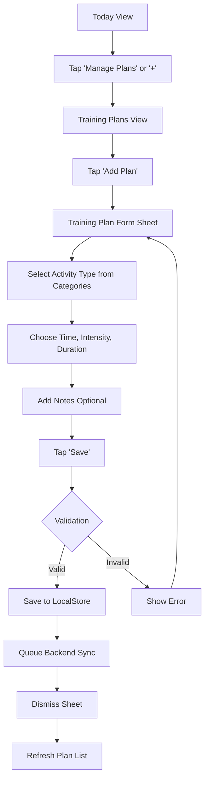

### 2. Edit Training Plan Flow

**Text Summary:**
1. User taps on a plan card in Training Plans View
2. Training Plan Detail Sheet appears
3. User taps "Edit" button
4. Training Plan Form Sheet appears (pre-filled with current values)
5. User modifies fields as needed
6. Taps "Save"
7. System validates changes
   - If valid → updates LocalStore → queues backend update → dismisses sheets → refreshes list
   - If invalid → shows error → returns to form
8. Alternative: User taps "Delete" → confirmation dialog → confirms → deletes from LocalStore → queues backend delete

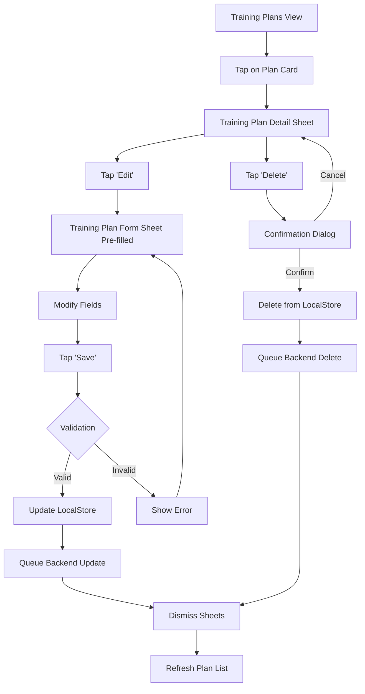

### 3. View Training Plan Details Flow

**Text Summary:**
1. User taps Training Plan Card from Today View
2. Training Plan Detail Sheet appears
3. User views full details: activity type, time, intensity, duration, notes, timestamps
4. User can tap "Edit" to modify or "Delete" to remove
5. User dismisses sheet to return

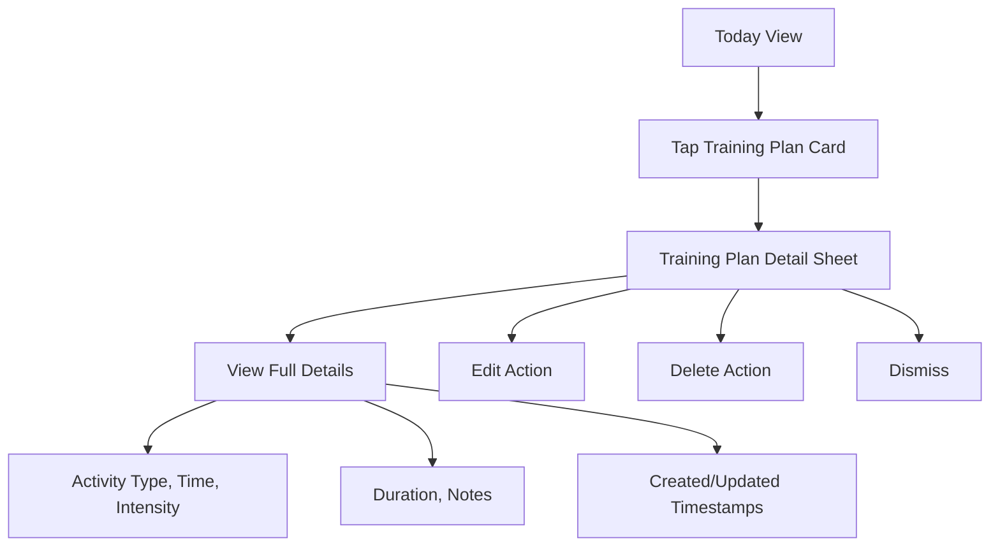

### 4. Activity Type Selection Flow

**Text Summary:**
1. User taps Activity Type Picker in Training Plan Form
2. Activity Type Selection View appears
3. User can either:
   - **Browse by Category**: Select category → browse activities → tap activity
   - **Search**: Type query → view filtered results → tap activity
4. Activity is selected
5. Returns to form with selected activity

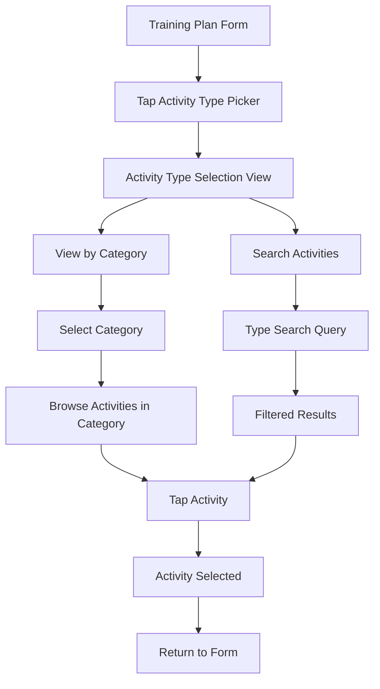

## Sequence Diagrams

### Create Training Plan Sequence

**Text Summary:**
1. User → TrainingPlansView: Tap "Add Plan"
2. TrainingPlansView → TrainingPlanFormSheet: Present form
3. User → TrainingPlanFormSheet: Fill details and tap "Save"
4. TrainingPlanFormSheet: Validate input
5. TrainingPlanFormSheet → TrainingPlansService: create(plan)
6. TrainingPlansService → LocalStore: save(plan)
7. TrainingPlansService → SupabaseManager: queueOperation(insert)
8. (If online) SupabaseManager → Backend API: POST /training-plans
9. Backend API → SupabaseManager: 201 Created
10. SupabaseManager → LocalStore: updateWithServerData()
11. TrainingPlanFormSheet: Dismiss
12. TrainingPlansView: Refresh list

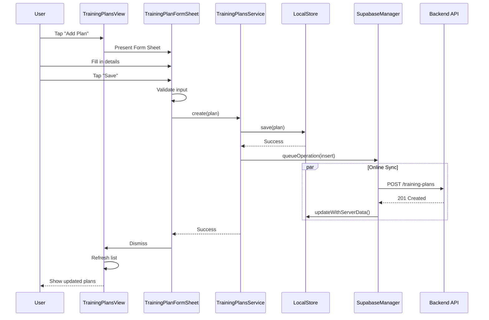

### Edit Training Plan Sequence

**Text Summary:**
1. User → TrainingPlansView: Tap plan card
2. TrainingPlansView → TrainingPlanDetailSheet: Present detail sheet with plan data
3. User → TrainingPlanDetailSheet: Tap "Edit"
4. TrainingPlanDetailSheet → TrainingPlanFormSheet: Present form (pre-filled)
5. User → TrainingPlanFormSheet: Modify fields and tap "Save"
6. TrainingPlanFormSheet: Validate
7. TrainingPlanFormSheet → TrainingPlansService: update(plan)
8. TrainingPlansService → LocalStore: update(plan)
9. TrainingPlansService → SupabaseManager: queueOperation(update)
10. (If online) SupabaseManager → Backend API: PUT /training-plans/:id
11. Backend API → SupabaseManager: 200 OK
12. SupabaseManager → LocalStore: updateWithServerData()
13. Forms dismiss and list refreshes

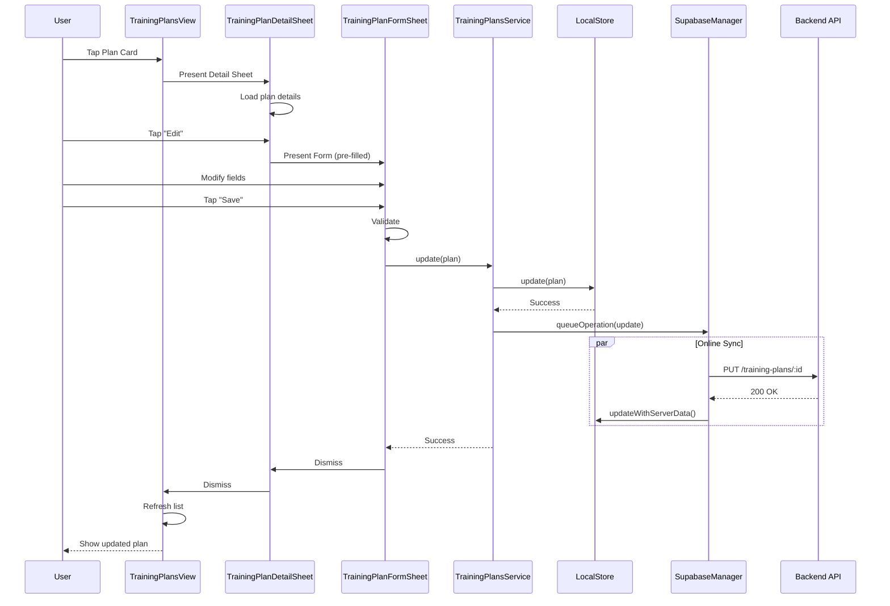

## State Management

### Training Plan Form State

```swift
@State private var mode: FormMode = .create // .create or .edit
@State private var planId: UUID? = nil
@State private var activityType: TrainingActivityType = .strengthTraining
@State private var intensity: String = "moderate"
@State private var sequence: Int = 1
@State private var durationMinutes: Int = 60
@State private var startTime: Date = defaultTime
@State private var notes: String = ""
@State private var isSaving: Bool = false
@State private var showError: Bool = false
@State private var errorMessage: String = ""
```

Implementation considerations

## Error Handling Strategy

### Client-Side Validation
- Activity type required
- Duration must be > 0 and < 480 minutes (8 hours)
- Sequence must be 1-6
- Start time validation (reasonable hours)
- Notes character limit (500 chars)

### Network Error Handling
- Offline queue: Store operations locally, sync when online
- Conflict resolution: Last-write-wins for same plan ID
- Retry with exponential backoff for failed syncs
- User feedback: Toast notifications for sync status

### Backend Validation
- Type constraint enforcement (database level)
- User authentication (RLS policies)
- Duplicate sequence prevention (unique constraint)
- Timezone handling for date boundaries

## Telemetry/Metrics

### Analytics Events
- `training_plan_created` - activity_type, duration, intensity
- `training_plan_edited` - fields_modified, time_to_edit
- `training_plan_deleted` - days_old, had_notes
- `activity_type_selected` - type, category, search_used
- `training_plan_viewed` - view_mode (list/detail/today_card)
- `edit_form_opened` - source (detail_sheet/swipe_action)
- `form_validation_error` - field, error_type

### Performance Metrics
- Form load time (create vs. edit)
- Save operation duration
- List rendering performance (plans per day)
- Activity picker search latency

## Performance Considerations

### Optimization Strategies
1. **Lazy Loading**: Load plans only for visible date range
2. **Caching**: Cache activity type metadata locally
3. **Debouncing**: Search input debounced by 300ms
4. **List Virtualization**: SwiftUI List handles large datasets efficiently
5. **Image Assets**: Pre-compile SF Symbols for activity icons
6. **Background Sync**: Use background tasks for operation queue processing

### Memory Management
- Limit loaded plan history to 90 days
- Clear old cached data on low memory warnings
- Use `@StateObject` appropriately to avoid retain cycles

## Security & Privacy

### Data Protection
- Training plans contain potentially sensitive info (workout routines)
- Encrypted at rest (Supabase encryption)
- Encrypted in transit (HTTPS)
- Local storage uses iOS Keychain for sensitive data

### Access Control
- RLS policies ensure users only access their own plans
- API endpoints validate `user_id` against authenticated user
- No public sharing of training plans (private by default)

## Accessibility

### VoiceOver Support
- All buttons have descriptive labels
- Activity type picker announces category and item
- Form fields have proper labels and hints
- Training plan cards announce key info: type, time, duration

### Dynamic Type
- All text scales with user's font size preference
- Maintain visual hierarchy at all font scales
- Test at largest accessibility sizes

### Color Contrast
- Ensure WCAG AA compliance (4.5:1 minimum)
- Don't rely solely on color for information (use icons + text)
- Test in dark mode and light mode

Alternatives considered

## Option A: Simple Type Expansion (Rejected)

**Approach**: Just add more string values to existing dropdown

**Pros**:
- Minimal code changes
- Quick implementation

**Cons**:
- Poor UX with 40+ items in flat list
- No search/filtering capability
- Difficult to discover relevant activities
- No visual categorization

**Decision**: Rejected in favor of categorized picker with search

## Option B: Tag-Based System (Deferred)

**Approach**: Allow users to tag activities with custom labels instead of predefined types

**Pros**:
- Ultimate flexibility
- User-driven categorization
- Handles niche activities

**Cons**:
- Complex UI/UX design
- Difficult to aggregate/analyze
- No standardization across users
- Increases cognitive load

**Decision**: Deferred to future iteration; start with comprehensive predefined types

## Option C: Inline Editing (Rejected)

**Approach**: Edit plan fields directly in list row instead of separate sheet

**Pros**:
- Fewer taps to edit
- Quicker for small changes

**Cons**:
- Cluttered UI
- Difficult on small screens
- No clear save/cancel flow
- Accidental edits possible

**Decision**: Rejected; use dedicated edit sheet for clarity and intentionality

## Option D: Calendar View for Planning (Future)

**Approach**: Full calendar interface for multi-day planning

**Pros**:
- Visualize full week/month
- Easier multi-day planning
- Drag-and-drop scheduling

**Cons**:
- Complex implementation
- Requires significant UI redesign
- May not fit small screens well

**Decision**: Consider for future enhancement; start with date picker + list view

Dependencies

## Technical Dependencies
- iOS 15+ (SwiftUI 3.0+)
- Supabase backend operational
- Existing `training_plans` table and RLS policies
- `SupabaseManager` operation queue functional
- `TrainingPlansService` protocol established

## Feature Dependencies
- Design system components (cards, buttons, pickers)
- Offline sync infrastructure
- LocalStore persistence layer
- Authentication system (user context)

## External Dependencies
- SF Symbols for activity icons (built-in iOS)
- DateFormatter utilities (Foundation)
- SwiftUI List and Form components

Open questions

1. **Activity type prioritization**: Should we show "most used" activities at top of categories?
2. **Default intensity by activity**: Should certain activities (e.g., yoga) default to "light" intensity?
3. **Duration presets**: Should duration options vary by activity type? (e.g., 15/30/45 min for meditation vs. 60/90/120 for running)
4. **Workout templates**: Future feature to save activity configurations as templates?
5. **Activity type migration**: Auto-migrate old types or leave as-is with manual update option?
6. **Search algorithm**: Simple string matching or fuzzy search for activity types?
7. **Localization**: Translate activity type names for international users?

References

- Kiro Concepts: https://kiro.dev/docs/specs/concepts/
- Current implementation: `DailyRitualSwiftiOS/Your Daily Dose/Views/TrainingPlansView.swift`
- Backend schema: `DailyRitualBackend/supabase/migrations/20240101000003_training_plans_refactor.sql`
- Whoop Activity Types: Reference for comprehensive activity library
- iOS Human Interface Guidelines: Form design best practices

Diagrams

## Component Architecture

**Text Description:**
- **iOS App Layer**:
  - Views: TodayView, TrainingPlansView, TrainingPlanDetailSheet, TrainingPlanFormSheet, ActivityTypePicker, TrainingPlanCard
  - Services: TrainingPlansService
  - Storage: LocalStore, SupabaseManager
- **Backend Layer**:
  - REST API → TrainingPlansController → Supabase Database
- **Data Flow**: Views → Service → LocalStore + SupabaseManager → API → Database
- **Offline Queue**: LocalStore queues operations in SupabaseManager for sync when online

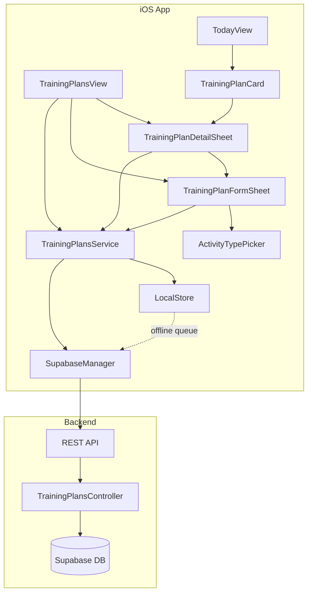

## Data Model ER Diagram

**Text Description:**
- **USER** has many **TRAINING_PLAN** (one-to-many)
- **USER** has many **WORKOUT_REFLECTION** (one-to-many)
- **TRAINING_PLAN** has zero or one **WORKOUT_REFLECTION** (one-to-zero-or-one)

**Key fields:**
- USER: id (PK), email, name
- TRAINING_PLAN: id (PK), user_id (FK), date, sequence, type (40+ values), start_time, intensity, duration_minutes, notes, created_at, updated_at
- WORKOUT_REFLECTION: id (PK), user_id (FK), training_plan_id (FK), date, workout_sequence, what_went_well, what_to_improve, training_feeling

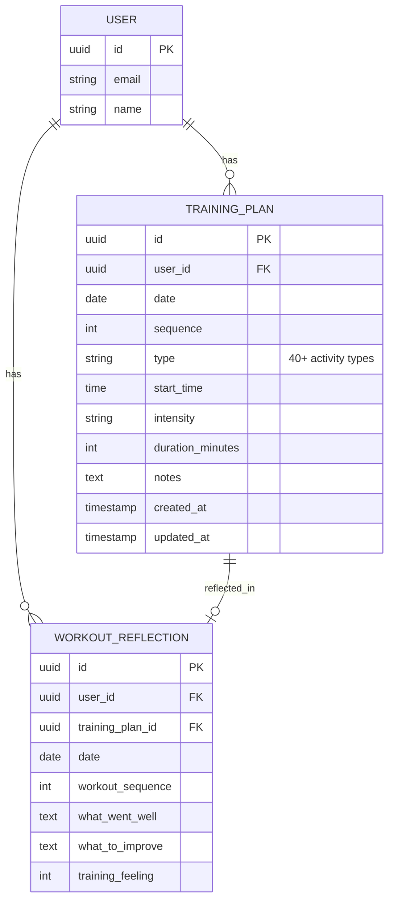

## UI Component Hierarchy

**Text Description:**
- **TrainingPlansView** contains:
  - NavigationView → List
    - DatePicker
    - TrainingPlanRow (1..n)
      - ActivityIcon
      - PlanDetails
      - TapGesture → Detail
  - AddButton → FormSheet
  
- **TrainingPlanDetailSheet** contains:
  - Header
  - DetailSections (activity, time, intensity, duration, notes)
  - ActionButtons (Edit → FormSheet, Delete)
  
- **TrainingPlanFormSheet** contains:
  - ActivityTypePicker
  - TimeFields
  - IntensityPicker
  - DurationSelector
  - NotesEditor
  - SaveButton
  
- **ActivityTypePicker** contains:
  - SearchBar
  - CategoryList → ActivityList by Category

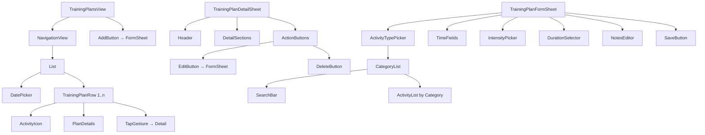

## Activity Type Picker UI Flow

**Text Description:**
1. User opens picker
2. User chooses action:
   - **Browse Categories** path: Select category → View activities in category → Tap activity
   - **Search** path: Type query → View filtered results → Tap activity
3. Activity is selected
4. Return to form

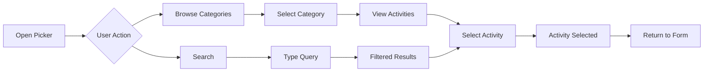

## Offline Sync Flow

**Text Description:**
1. App saves plan to LocalStore (works offline)
2. LocalStore confirms success to app
3. App queues sync operation in Operation Queue
4. Operation Queue checks network connectivity:
   - **If Online**: Sends operation to Backend → receives success → updates LocalStore with synced status
   - **If Offline**: Retries later with exponential backoff
5. Operation Queue maintains pending operations until successfully synced

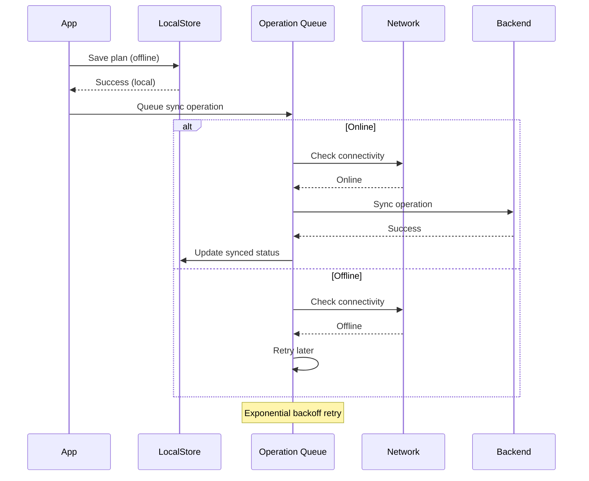

