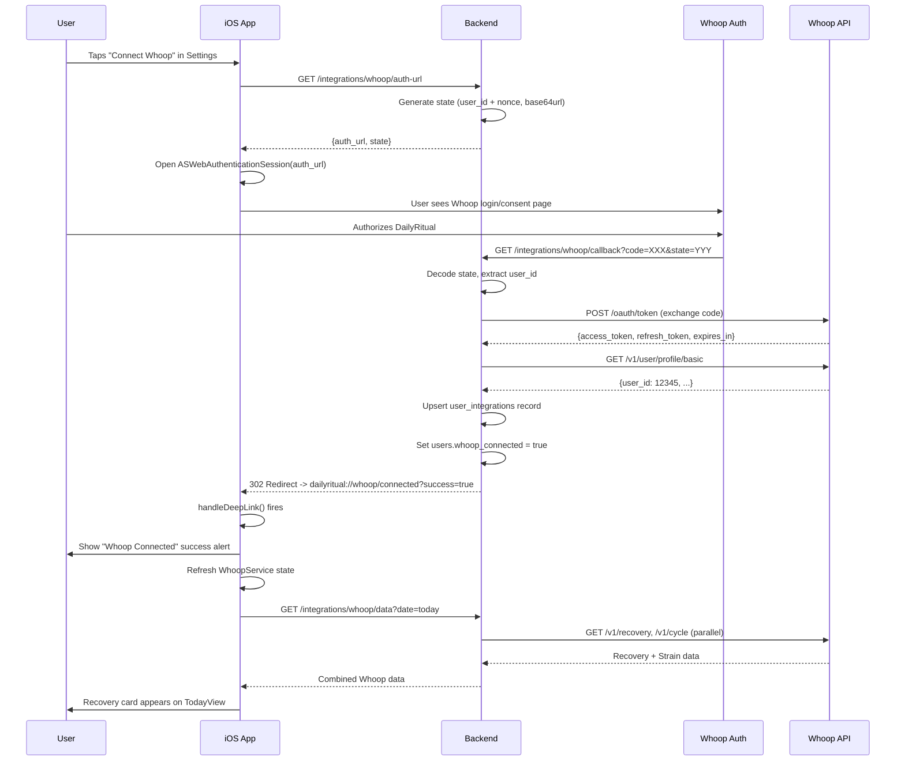
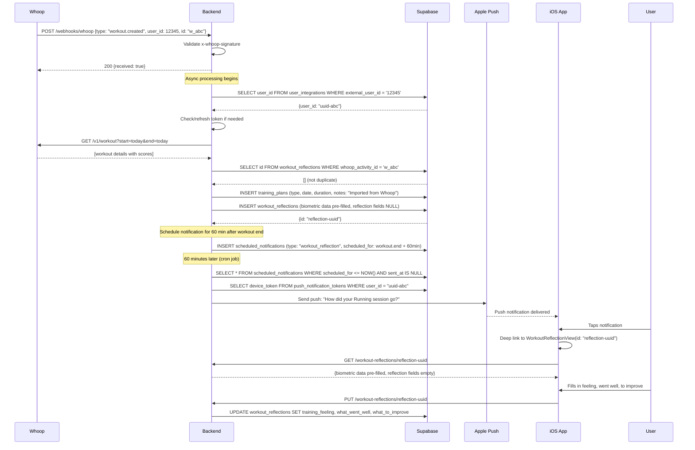
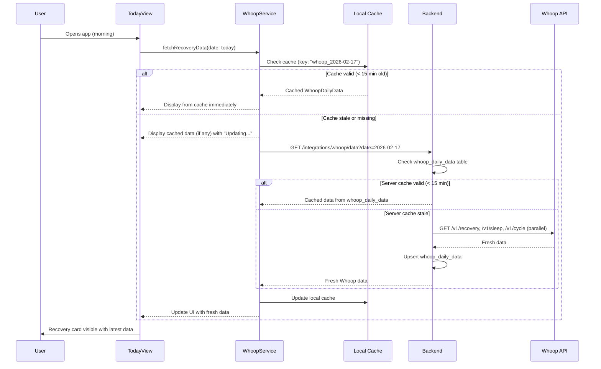
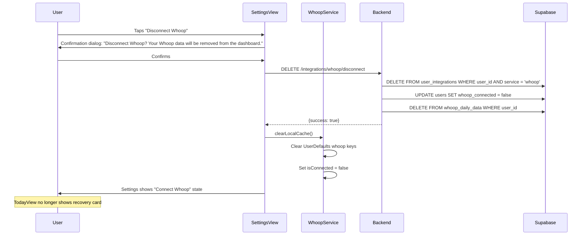

# Design

## Overview

### Summary
This feature completes the Whoop wearable integration for DailyRitual, building the iOS-side experience on top of the already-implemented backend OAuth flow, webhook handler, and workout import pipeline. The integration surfaces biometric data (recovery, sleep, strain, HRV) directly in the athlete's daily practice, triggers post-workout reflection notifications, and provides recovery-aware training guidance. The design philosophy treats Whoop data as a supporting signal that enhances -- but never replaces -- the athlete's own self-assessment through journaling.

### Goals
- **Primary Goal:** Surface Whoop recovery and sleep data on the morning dashboard to inform the athlete's daily intention setting
- **Secondary Goal:** Automate post-workout reflection triggers via webhook-driven workout detection, increasing reflection completion rate from 15% to 40%+
- **UX Goal:** Make Whoop data feel native to the DailyRitual experience -- not a bolted-on integration, but a natural extension of the daily practice
- **Technical Goal:** Build a resilient iOS data layer that caches Whoop data locally, handles token refresh transparently, and degrades gracefully offline

### Non-Goals
- Displaying Whoop data in AI-generated insights (Phase 2)
- Writing data back to the Whoop platform
- Historical data backfill beyond 7-day initial sync
- Whoop Teams or coach-facing Whoop dashboards
- Body composition or body measurement data
- Strava or Apple Health integration (separate specs)

### Key Risks and Mitigations

| Risk | Impact | Probability | Mitigation |
|------|--------|-------------|------------|
| Whoop API rate limiting (10 req/min/user) | Medium | High | Aggressive client-side caching (15-min TTL); batch requests; exponential backoff |
| Token refresh race conditions | High | Medium | Mutex lock on token refresh; queue concurrent requests until refresh completes |
| Whoop developer app approval delays | High | Medium | Submit app for review early; use sandbox environment for development |
| Webhook delivery failures | Medium | Low | Webhook handler is idempotent; manual sync fallback; periodic background reconciliation |
| User confusion about recovery zones | Low | Medium | Clear color coding with brief explanatory text; link to Whoop education content |
| OAuth flow interrupted (user closes browser) | Low | High | Detect incomplete flow; show "Connection incomplete" message; allow retry |
| Push notification permission denied | Medium | Medium | Pre-prompt explanation before requesting permission; in-app badge fallback |

## Architecture

### System Components

```
┌──────────────────────────────────────────────────────────────────────────┐
│                           iOS App (SwiftUI)                              │
├──────────────────────────────────────────────────────────────────────────┤
│                                                                          │
│  ┌────────────────────┐  ┌──────────────────┐  ┌─────────────────────┐  │
│  │ TodayView          │  │ SettingsView     │  │ WorkoutReflection   │  │
│  │ ┌────────────────┐ │  │ ┌──────────────┐ │  │ View                │  │
│  │ │WhoopRecovery   │ │  │ │WhoopConnect  │ │  │ (Pre-filled from    │  │
│  │ │Card            │ │  │ │View          │ │  │  Whoop data)        │  │
│  │ └────────┬───────┘ │  │ └──────┬───────┘ │  └──────────┬──────────┘  │
│  └──────────┼─────────┘  └────────┼─────────┘           │              │
│             │                     │                      │              │
│             └─────────┬───────────┴──────────────────────┘              │
│                       │                                                  │
│             ┌─────────▼──────────┐    ┌──────────────────────┐          │
│             │ WhoopService.swift │    │ WhoopDataCache       │          │
│             │ (@MainActor)       │    │ (UserDefaults +      │          │
│             │ - connect()        │    │  in-memory)          │          │
│             │ - disconnect()     │    └──────────┬───────────┘          │
│             │ - fetchRecovery()  │               │                      │
│             │ - fetchSleep()     │◄──────────────┘                      │
│             │ - syncData()       │                                       │
│             └─────────┬──────────┘                                       │
│                       │                                                  │
└───────────────────────┼──────────────────────────────────────────────────┘
                        │ HTTPS (via APIClient)
                        │
┌───────────────────────▼──────────────────────────────────────────────────┐
│                    Backend (Express.js + TypeScript)                      │
├──────────────────────────────────────────────────────────────────────────┤
│                                                                          │
│  ┌─────────────────────────────────────────────────────────────────┐    │
│  │ IntegrationsController (EXISTING)                               │    │
│  │ GET  /integrations              - List all integrations         │    │
│  │ GET  /integrations/whoop/auth-url - Generate OAuth URL          │    │
│  │ GET  /integrations/whoop/callback - OAuth redirect handler      │    │
│  │ POST /integrations/whoop/connect  - Exchange code for tokens    │    │
│  │ DEL  /integrations/whoop/disconnect - Remove connection         │    │
│  │ POST /integrations/whoop/sync     - Manual data sync            │    │
│  └─────────────────────────────────────────────────────────────────┘    │
│                                                                          │
│  ┌─────────────────────────────────────────────────────────────────┐    │
│  │ NEW: GET /integrations/whoop/data - Fetch today's combined data │    │
│  │   Returns: recovery + sleep + strain for a given date           │    │
│  └─────────────────────────────────────────────────────────────────┘    │
│                                                                          │
│  ┌─────────────────────────────────────────────────────────────────┐    │
│  │ WebhooksController (EXISTING)                                   │    │
│  │ POST /webhooks/whoop - Handles workout.created/updated,         │    │
│  │                        recovery.updated                         │    │
│  └─────────────────────────────────────────────────────────────────┘    │
│                                                                          │
│  ┌─────────────────────────────────────────────────────────────────┐    │
│  │ NEW: NotificationService                                        │    │
│  │ - Schedules push notification 60 min after workout end time     │    │
│  │ - Manages APNs token storage and delivery                       │    │
│  └─────────────────────────────────────────────────────────────────┘    │
│                                                                          │
│  ┌─────────────────────────────────────────────────────────────────┐    │
│  │ WhoopService (EXISTING)                                         │    │
│  │ - getAuthorizationUrl(), exchangeCodeForTokens()                │    │
│  │ - refreshAccessToken(), getUserProfile()                        │    │
│  │ - getRecoveryData(), getStrainData(), getCombinedData()         │    │
│  │ - getWorkouts(), importWhoopWorkout()                           │    │
│  │ - getSleepData() (NEW)                                          │    │
│  │ - setupWebhook(), validateWebhookSignature()                    │    │
│  └─────────────────────────────────────────────────────────────────┘    │
│                                                                          │
└───────────────────────┬──────────────────────────────────────────────────┘
                        │
                        │ SQL / Supabase Client
                        │
┌───────────────────────▼──────────────────────────────────────────────────┐
│                      Supabase PostgreSQL                                 │
├──────────────────────────────────────────────────────────────────────────┤
│                                                                          │
│  user_integrations (EXISTING)                                            │
│  ├── id, user_id, service, access_token, refresh_token                  │
│  ├── token_expires_at, external_user_id, last_sync_at, connected_at     │
│  └── UNIQUE(user_id, service)                                           │
│                                                                          │
│  users (EXISTING - has whoop_connected boolean)                          │
│                                                                          │
│  workout_reflections (EXISTING - has whoop fields)                       │
│  ├── whoop_activity_id, strain_score, recovery_score                    │
│  ├── sleep_performance, hrv, resting_hr                                 │
│  └── average_hr, max_hr, calories_burned                                │
│                                                                          │
│  training_plans (EXISTING - receives Whoop workout imports)              │
│                                                                          │
│  NEW: whoop_daily_data (cache table for dashboard display)              │
│  ├── id, user_id, date (UNIQUE user_id+date)                           │
│  ├── recovery_score, recovery_zone, sleep_performance                   │
│  ├── hrv, resting_hr, strain_score                                      │
│  ├── sleep_duration_minutes, sleep_efficiency                           │
│  ├── sleep_stages (JSONB), respiratory_rate, skin_temp_delta            │
│  ├── raw_recovery_json (JSONB), raw_sleep_json (JSONB)                  │
│  └── fetched_at, created_at                                             │
│                                                                          │
│  NEW: push_notification_tokens                                           │
│  ├── id, user_id, device_token, platform, created_at                    │
│  └── UNIQUE(user_id, device_token)                                      │
│                                                                          │
│  NEW: scheduled_notifications                                            │
│  ├── id, user_id, type, payload (JSONB)                                 │
│  ├── scheduled_for, sent_at, created_at                                 │
│  └── INDEX(scheduled_for) WHERE sent_at IS NULL                         │
│                                                                          │
└──────────────────────────────────────────────────────────────────────────┘

                        │
            ┌───────────┴───────────┐
            │   Whoop API           │
            │   api.prod.whoop.com  │
            │   /developer/v1/...   │
            └───────────────────────┘
```

### Component Responsibilities

#### Frontend Components

**WhoopService.swift** (New - `@MainActor`)
- Orchestrates all Whoop interactions from the iOS side
- Initiates OAuth flow via `ASWebAuthenticationSession`
- Fetches and caches recovery/sleep/strain data
- Manages local cache invalidation (15-minute TTL)
- Exposes `@Published` properties: `recoveryData`, `isConnected`, `isLoading`, `lastSyncDate`
- Handles deep link callback from OAuth flow
- Communicates with backend via `SupabaseManager.shared.api`

**WhoopRecoveryCard** (New View)
- Displays recovery score with circular progress indicator
- Color-coded by zone: green (67-100), yellow (34-66), red (0-33)
- Secondary metrics: sleep %, HRV, resting HR in compact row
- Training recommendation text based on recovery zone
- Tap gesture opens SleepDetailView
- "Powered by WHOOP" attribution footer

**SleepDetailView** (New View)
- Sheet presentation from WhoopRecoveryCard tap
- Sleep stages bar chart (awake, light, REM, deep)
- Key metrics: total duration, time in bed, efficiency %, disturbances
- Respiratory rate and skin temperature delta
- Historical context: "vs. your 30-day average" comparisons

**WhoopConnectView** (New View)
- Lives in Settings > Integrations section
- Connected state: shows connection date, last sync time, "Sync Now" button, "Disconnect" button
- Disconnected state: shows Whoop logo, value proposition text, "Connect Whoop" button
- Privacy toggles for metric visibility

**WorkoutReflectionView** (Extend Existing)
- When opened from a Whoop-imported reflection, pre-fills biometric data (calories, HR, strain)
- Shows Whoop-sourced data in a "Biometrics" section above the reflection prompts
- Read-only biometric fields (user fills in feeling, went well, to improve)

#### Backend Components

**IntegrationsController** (Extend Existing)
- Add `GET /integrations/whoop/data?date=YYYY-MM-DD` endpoint
- Returns combined recovery + sleep + strain data for the given date
- Handles token refresh transparently
- Caches fetched data in `whoop_daily_data` table

**WhoopService** (Extend Existing)
- Add `getSleepData(accessToken, date)` method for detailed sleep metrics
- Add `getBodyMeasurements(accessToken)` method stub for future use
- Improve error handling with typed error classes
- Add request queuing for rate limit compliance

**NotificationService** (New)
- Stores APNs device tokens
- Schedules delayed notifications (60 min after workout end)
- Background job processes `scheduled_notifications` table
- Sends via APNs (or Firebase Cloud Messaging as fallback)

**WebhooksController** (Extend Existing)
- After successful workout import, create a `scheduled_notifications` record
- Handle `sleep.updated` event type to refresh sleep cache

## Data Model

### New Table: `whoop_daily_data`

```sql
CREATE TABLE IF NOT EXISTS whoop_daily_data (
    id UUID PRIMARY KEY DEFAULT gen_random_uuid(),
    user_id UUID NOT NULL REFERENCES auth.users(id) ON DELETE CASCADE,
    date DATE NOT NULL,

    -- Recovery metrics
    recovery_score REAL,          -- 0-100
    recovery_zone TEXT CHECK (recovery_zone IN ('green', 'yellow', 'red')),

    -- Sleep metrics
    sleep_performance REAL,       -- 0-100 percentage
    sleep_duration_minutes INT,   -- Total sleep time
    sleep_efficiency REAL,        -- 0-100 percentage
    sleep_stages JSONB,           -- {"awake": min, "light": min, "rem": min, "deep": min}
    respiratory_rate REAL,        -- Breaths per minute
    skin_temp_delta REAL,         -- Degrees F delta from baseline

    -- Heart rate
    hrv REAL,                     -- HRV RMSSD in milliseconds
    resting_hr INT,               -- Resting heart rate BPM

    -- Strain
    strain_score REAL,            -- 0-21 day strain

    -- Raw data for future use
    raw_recovery_json JSONB,
    raw_sleep_json JSONB,
    raw_cycle_json JSONB,

    -- Metadata
    fetched_at TIMESTAMPTZ DEFAULT NOW(),
    created_at TIMESTAMPTZ DEFAULT NOW(),

    UNIQUE(user_id, date)
);

CREATE INDEX idx_whoop_daily_data_user_date ON whoop_daily_data(user_id, date DESC);

-- RLS
ALTER TABLE whoop_daily_data ENABLE ROW LEVEL SECURITY;

CREATE POLICY "Users can view own whoop data"
    ON whoop_daily_data FOR SELECT
    USING (auth.uid() = user_id);

CREATE POLICY "Service role full access to whoop data"
    ON whoop_daily_data FOR ALL
    USING (auth.role() = 'service_role');
```

### New Table: `push_notification_tokens`

```sql
CREATE TABLE IF NOT EXISTS push_notification_tokens (
    id UUID PRIMARY KEY DEFAULT gen_random_uuid(),
    user_id UUID NOT NULL REFERENCES auth.users(id) ON DELETE CASCADE,
    device_token TEXT NOT NULL,
    platform TEXT NOT NULL DEFAULT 'ios',
    created_at TIMESTAMPTZ DEFAULT NOW(),
    updated_at TIMESTAMPTZ DEFAULT NOW(),

    UNIQUE(user_id, device_token)
);
```

### New Table: `scheduled_notifications`

```sql
CREATE TABLE IF NOT EXISTS scheduled_notifications (
    id UUID PRIMARY KEY DEFAULT gen_random_uuid(),
    user_id UUID NOT NULL REFERENCES auth.users(id) ON DELETE CASCADE,
    type TEXT NOT NULL CHECK (type IN ('workout_reflection', 'streak_reminder', 'recovery_update')),
    title TEXT NOT NULL,
    body TEXT NOT NULL,
    payload JSONB,                -- {"workout_reflection_id": "uuid", "workout_type": "running"}
    scheduled_for TIMESTAMPTZ NOT NULL,
    sent_at TIMESTAMPTZ,          -- NULL until actually sent
    created_at TIMESTAMPTZ DEFAULT NOW()
);

CREATE INDEX idx_scheduled_notifications_pending
    ON scheduled_notifications(scheduled_for)
    WHERE sent_at IS NULL;
```

### New Swift Model: `WhoopDailyData`

```swift
// File: DailyRitualSwiftiOS/Your Daily Dose/Data/WhoopModels.swift

struct WhoopDailyData: Codable, Identifiable, Sendable {
    let id: UUID
    let userId: UUID
    let date: Date

    // Recovery
    var recoveryScore: Double?
    var recoveryZone: RecoveryZone?

    // Sleep
    var sleepPerformance: Double?
    var sleepDurationMinutes: Int?
    var sleepEfficiency: Double?
    var sleepStages: SleepStages?
    var respiratoryRate: Double?
    var skinTempDelta: Double?

    // Heart rate
    var hrv: Double?
    var restingHr: Int?

    // Strain
    var strainScore: Double?

    let fetchedAt: Date?

    enum RecoveryZone: String, Codable, Sendable {
        case green, yellow, red

        var color: Color {
            switch self {
            case .green: return DesignSystem.Colors.powerGreen
            case .yellow: return DesignSystem.Colors.eliteGold
            case .red: return DesignSystem.Colors.alertRed
            }
        }

        var recommendation: String {
            switch self {
            case .green: return "Recovery is green. You're primed for a high-intensity session today."
            case .yellow: return "Moderate recovery. A standard training session should work well today."
            case .red: return "Your recovery is in the red zone. Consider a lighter training session or active recovery today."
            }
        }

        init(score: Double) {
            if score >= 67 { self = .green }
            else if score >= 34 { self = .yellow }
            else { self = .red }
        }
    }

    struct SleepStages: Codable, Sendable {
        let awake: Int       // minutes
        let light: Int       // minutes
        let rem: Int         // minutes
        let deep: Int        // minutes

        var totalSleep: Int { light + rem + deep }
        var totalInBed: Int { awake + light + rem + deep }
    }

    // CodingKeys
    private enum CodingKeys: String, CodingKey {
        case id
        case userId = "user_id"
        case date
        case recoveryScore = "recovery_score"
        case recoveryZone = "recovery_zone"
        case sleepPerformance = "sleep_performance"
        case sleepDurationMinutes = "sleep_duration_minutes"
        case sleepEfficiency = "sleep_efficiency"
        case sleepStages = "sleep_stages"
        case respiratoryRate = "respiratory_rate"
        case skinTempDelta = "skin_temp_delta"
        case hrv
        case restingHr = "resting_hr"
        case strainScore = "strain_score"
        case fetchedAt = "fetched_at"
    }
}
```

### API Contract: `GET /integrations/whoop/data`

**Request:**
```
GET /api/v1/integrations/whoop/data?date=2026-02-17
Authorization: Bearer <jwt>
```

**Response (200):**
```json
{
  "success": true,
  "data": {
    "recovery": {
      "score": 78,
      "zone": "green",
      "hrv": 62.4,
      "resting_hr": 52,
      "skin_temp_delta": 0.3,
      "respiratory_rate": 15.2
    },
    "sleep": {
      "performance": 85,
      "duration_minutes": 458,
      "efficiency": 91.2,
      "stages": {
        "awake": 42,
        "light": 198,
        "rem": 112,
        "deep": 106
      }
    },
    "strain": {
      "score": 8.4
    },
    "fetched_at": "2026-02-17T07:30:00Z"
  }
}
```

**Response (no data yet):**
```json
{
  "success": true,
  "data": null,
  "message": "No Whoop data available for this date"
}
```

**Response (not connected):**
```json
{
  "success": false,
  "error": {
    "error": "Not connected",
    "message": "Whoop is not connected. Connect in Settings > Integrations."
  }
}
```

## UI/UX Design

### Morning Dashboard - Recovery Card

**Location:** TodayView, above morning ritual card, below streak widget (if present). Only visible when Whoop is connected and recovery data is available.

```
┌───────────────────────────────────────────────────────┐
│                                                       │
│  ┌─── Recovery ────────────────── Powered by WHOOP ─┐│
│  │                                                   ││
│  │  ┌──────────┐                                     ││
│  │  │   78%    │  Recovery Score                     ││
│  │  │  ┌────┐  │  ● Green Zone                      ││
│  │  │  │ ██ │  │                                     ││
│  │  │  │ ██ │  │  You're primed for a high-          ││
│  │  │  └────┘  │  intensity session today.           ││
│  │  └──────────┘                                     ││
│  │                                                   ││
│  │  Sleep 85%    HRV 62ms    HR 52bpm               ││
│  │                                                   ││
│  │  Tap for sleep details              Updated 7:30a ││
│  └───────────────────────────────────────────────────┘│
│                                                       │
│  ┌─── Morning Ritual ────────────────────────────────┐│
│  │ ...existing morning ritual card...                ││
│  └───────────────────────────────────────────────────┘│
```

**Recovery Score Circle:**
- Circular progress indicator (like Apple Watch rings)
- Color fills based on zone: green/yellow/red
- Large percentage number in center
- Smooth animation on appearance

**Secondary Metrics Row:**
- Three compact stat badges in a horizontal row
- Each shows icon + value + unit
- Sleep: moon icon, percentage
- HRV: waveform icon, milliseconds
- HR: heart icon, BPM

### Sleep Detail View

**Navigation:** Sheet presented when recovery card is tapped

```
┌───────────────────────────────────────────────────────┐
│ ← Sleep Details                              [Close X]│
├───────────────────────────────────────────────────────┤
│                                                       │
│  Last Night's Sleep                                   │
│  7h 38m total  •  91% efficiency                     │
│                                                       │
│  ┌─────────────────────────────────────────────────┐ │
│  │ Sleep Stages                                     │ │
│  │                                                   │ │
│  │ ████████████████████░░░░░░░░░░████████░░░░░░░░  │ │
│  │ Light (3h 18m)  Awake  REM (1h 52m) Deep (1h 46m│ │
│  └─────────────────────────────────────────────────┘ │
│                                                       │
│  Key Metrics                                         │
│  ┌──────────┐  ┌──────────┐  ┌──────────┐          │
│  │ HRV      │  │ Rest HR  │  │ Resp Rate│          │
│  │ 62 ms    │  │ 52 bpm   │  │ 15.2/min │          │
│  │ +4 avg   │  │ -2 avg   │  │ normal   │          │
│  └──────────┘  └──────────┘  └──────────┘          │
│                                                       │
│  Skin Temp: +0.3F from baseline                      │
│                                                       │
│  Recovery Assessment                                  │
│  ┌─────────────────────────────────────────────────┐ │
│  │ 78% Recovery • Green Zone                        │ │
│  │ Your body is well-recovered. Push hard today.    │ │
│  └─────────────────────────────────────────────────┘ │
│                                                       │
└───────────────────────────────────────────────────────┘
```

### Settings - Integrations View

```
┌───────────────────────────────────────────────────────┐
│ ← Integrations                                        │
├───────────────────────────────────────────────────────┤
│                                                       │
│  Connected                                            │
│  ┌───────────────────────────────────────────────────┐│
│  │ [WHOOP Logo]  WHOOP             Connected ✓      ││
│  │               Since Feb 10, 2026                  ││
│  │               Last sync: 5 min ago                ││
│  │                                                   ││
│  │  [Sync Now]              [Disconnect]             ││
│  └───────────────────────────────────────────────────┘│
│                                                       │
│  Privacy Settings                                     │
│  ┌───────────────────────────────────────────────────┐│
│  │ Show Recovery Score            [████████ ON]      ││
│  │ Show Sleep Data                [████████ ON]      ││
│  │ Show Strain Score              [████████ ON]      ││
│  │ Show Heart Rate Data           [████████ ON]      ││
│  │ Include in Coach Exports       [░░░░░░░ OFF]     ││
│  └───────────────────────────────────────────────────┘│
│                                                       │
│  Coming Soon                                          │
│  ┌───────────────────────────────────────────────────┐│
│  │ [Strava Logo]  Strava          Coming Soon        ││
│  │ [AH Logo]      Apple Health    Coming Soon        ││
│  └───────────────────────────────────────────────────┘│
│                                                       │
└───────────────────────────────────────────────────────┘
```

**Disconnected State:**
```
┌───────────────────────────────────────────────────────┐
│  [WHOOP Logo]  WHOOP                                 │
│                                                       │
│  Connect your Whoop to see recovery, sleep, and       │
│  strain data in your daily practice.                  │
│                                                       │
│          [ Connect Whoop ]                            │
│                                                       │
│  Your data stays private. You control what's visible. │
└───────────────────────────────────────────────────────┘
```

### Workout Reflection (Whoop-Imported)

```
┌───────────────────────────────────────────────────────┐
│ ← Workout Reflection                                  │
├───────────────────────────────────────────────────────┤
│                                                       │
│  Running • 45 min • Today 7:30 AM                    │
│  Imported from Whoop                                  │
│                                                       │
│  Biometrics                                           │
│  ┌───────────────────────────────────────────────────┐│
│  │ Strain  │ Avg HR   │ Max HR   │ Calories         ││
│  │ 12.4    │ 152 bpm  │ 178 bpm  │ 420 kcal        ││
│  └───────────────────────────────────────────────────┘│
│                                                       │
│  How did the session feel?                            │
│  [ 1 ] [ 2 ] [ 3 ] [ 4 ] [ 5 ]                     │
│                                                       │
│  What went well?                                      │
│  ┌───────────────────────────────────────────────────┐│
│  │                                                   ││
│  │                                                   ││
│  └───────────────────────────────────────────────────┘│
│                                                       │
│  What can you improve next session?                   │
│  ┌───────────────────────────────────────────────────┐│
│  │                                                   ││
│  │                                                   ││
│  └───────────────────────────────────────────────────┘│
│                                                       │
│              [ Submit Reflection ]                     │
└───────────────────────────────────────────────────────┘
```

## Implementation Considerations

### Error Handling Strategy

**Token Expiration:**
1. iOS `WhoopService` checks `token_expires_at` before every API call
2. If within 5 minutes of expiry, proactively calls `POST /integrations/whoop/connect` with refresh
3. Backend `refreshAccessToken()` already handles the Whoop token refresh
4. If refresh fails (invalid_grant), mark integration as expired and show re-connect prompt

**Network Failures:**
1. All Whoop data requests use cached data as fallback
2. Cache is stored in UserDefaults (serialized `WhoopDailyData`)
3. UI shows "Last updated X ago" timestamp
4. Subtle indicator (not blocking) when refresh fails
5. Never block morning ritual flow due to Whoop data unavailability

**Webhook Failures:**
1. Handler always returns 200 to prevent Whoop retries flooding the endpoint
2. Processing errors are logged but don't affect the response
3. Failed imports are retried on the next manual sync
4. Duplicate detection via `whoop_activity_id` prevents double-imports

**Rate Limiting:**
1. Backend maintains a per-user request counter (in-memory, reset every minute)
2. If approaching rate limit, queue requests and process after cooldown
3. iOS caches aggressively (15-minute TTL) to minimize API calls
4. Batch data fetch: single `GET /integrations/whoop/data` call gets recovery + sleep + strain

### Performance Considerations

**iOS Client:**
- Recovery card data cached in `UserDefaults` with 15-minute TTL
- In-memory cache for active session (no disk IO on every view)
- Recovery card view is lightweight -- no heavy animations on load
- Sleep detail view loads on-demand (not pre-fetched)
- Background refresh uses `BGAppRefreshTask` for periodic sync

**Backend:**
- `whoop_daily_data` table serves as server-side cache -- avoids redundant Whoop API calls
- Combined data endpoint makes parallel requests to Whoop (recovery + sleep + cycle)
- Index on `(user_id, date DESC)` for fast lookups
- Webhook processing is async -- acknowledge immediately, process in background

**Push Notifications:**
- `scheduled_notifications` table polled every 30 seconds by a lightweight cron job
- Batch APNs delivery for efficiency
- Notification scheduling avoids quiet hours (10 PM - 7 AM user timezone)

### Security Considerations

**Token Storage:**
- Whoop access and refresh tokens stored in `user_integrations` table
- Table uses RLS + service role bypass for backend operations
- Tokens never sent to the iOS client -- all Whoop API calls go through the backend
- Tokens are not logged (masked in error messages)

**Webhook Validation:**
- `x-whoop-signature` header validated using HMAC-SHA256 with `WHOOP_WEBHOOK_SECRET`
- Invalid signatures return 401
- In development (no secret configured), validation is skipped with a warning log

**OAuth Security:**
- State parameter encodes user_id + random nonce in base64url
- State is verified on callback to prevent CSRF
- Authorization code is single-use and exchanged immediately
- Redirect URI must match exactly what's registered with Whoop

**Privacy:**
- User can toggle visibility of each metric category
- Privacy preferences stored in `UserDefaults` on device (not synced)
- Coach export respects the "Include in Coach Exports" toggle
- Whoop data is user-scoped -- no cross-user data access possible via RLS

## Flows

### OAuth Connection Flow



### Webhook Workout Import Flow



### Morning Data Sync Flow



### Disconnect Flow



## Alternatives Considered

### Alternative 1: Client-Side Whoop API Calls (iOS Direct)
**Pros:** Lower latency for data fetch; no backend dependency for reads; simpler architecture
**Cons:** Tokens on device increase security risk; can't do webhook processing client-side; rate limiting harder to manage; token refresh more complex on iOS
**Decision:** Rejected. Keep all Whoop API calls server-side. Tokens never touch the client. Backend serves as a secure proxy and caching layer.

### Alternative 2: Real-Time Whoop Data via WebSocket
**Pros:** Instant updates when Whoop processes data; no polling; feels truly live
**Cons:** Overkill for data that updates a few times per day; WebSocket infrastructure complexity; battery drain on mobile; Whoop doesn't provide real-time streaming
**Decision:** Rejected. Polling with 15-minute TTL cache is sufficient. Webhooks handle event-driven updates for workouts.

### Alternative 3: Store All Whoop Data in workout_reflections Only
**Pros:** No new tables; simpler schema; data already co-located with reflections
**Cons:** Recovery/sleep data doesn't always have an associated workout; daily recovery data needs its own home; schema becomes overloaded with non-reflection data
**Decision:** Rejected. Create `whoop_daily_data` table for daily biometric cache. Keep `workout_reflections` focused on workout-specific data.

### Alternative 4: Use Supabase Edge Functions for Whoop Webhook Processing
**Pros:** Serverless; auto-scaling; Supabase-native
**Cons:** Edge function cold starts; harder to debug; existing backend already handles webhooks; would split logic across two runtimes
**Decision:** Rejected. Keep webhook processing in the existing Express backend. Single runtime, single deployment, easier debugging.

### Alternative 5: Show Whoop Promo Card to Non-Connected Users
**Pros:** Drive Whoop connections; educate users about the integration; potential affiliate revenue
**Cons:** Clutters TodayView for users without Whoop; feels like advertising; may alienate users who use other wearables
**Decision:** Rejected for TodayView. Only show Whoop integration option in Settings > Integrations. The dashboard stays clean and focused on the user's current tools.

### Alternative 6: Delayed Notification via Whoop Webhook Timing Only
**Pros:** Simpler -- no scheduled_notifications table; just send notification immediately on webhook
**Cons:** Webhook fires when workout is detected, not when it ends; notification would arrive during the workout or immediately after (no reflection cool-down)
**Decision:** Rejected. Use the `scheduled_notifications` table to delay notification by 60 minutes after workout end time. This gives the athlete time to shower, eat, and transition before reflecting.

## References

- Whoop Developer API: `https://developer.whoop.com/docs/developing/api-overview`
- Whoop API Endpoints: Recovery (`/v1/recovery`), Sleep (`/v1/activity/sleep`), Cycle (`/v1/cycle`), Workout (`/v1/workout`), Body (`/v1/body_measurement`)
- Whoop OAuth Scopes: `read:recovery`, `read:workout`, `read:sleep`, `read:profile`, `read:body_measurement`
- Existing Backend Code: `/DailyRitualBackend/src/services/integrations/whoop.ts`
- Existing Controller: `/DailyRitualBackend/src/controllers/integrations.ts`
- Existing Webhook Handler: `/DailyRitualBackend/src/controllers/webhooks.ts`
- iOS App Entry Point: `/DailyRitualSwiftiOS/Your Daily Dose/Your_Daily_DoseApp.swift`
- iOS Models: `/DailyRitualSwiftiOS/Your Daily Dose/Data/Models.swift` (WorkoutReflection with Whoop fields)
- Database Types: `/DailyRitualBackend/src/types/database.ts`
- API Types: `/DailyRitualBackend/src/types/api.ts` (WhoopData interface)
- Migration: `/DailyRitualBackend/supabase/migrations/20250206000001_user_integrations.sql`
- DesignSystem: `/DailyRitualSwiftiOS/Your Daily Dose/Design/DesignSystem.swift`
- ASWebAuthenticationSession Docs: `https://developer.apple.com/documentation/authenticationservices/aswebauthenticationsession`
- Kiro Concepts: https://kiro.dev/docs/specs/concepts/
